# Notes on Microwave Engineering

Eliot (Tianyang) Chen | 编写-2023FA | 修订-2024FA

> 本文档的 `.md`原始文件与更新版本请见雨霏的 GitHub:
>
> 
>
> 
https://github.com/EliotChen8/Enlightenment-Exchange/tree/main/2023/SUSTC-EE316-MicrowaveEngineering/notes/part_1

>
> 本文档属于`Enlightenment-Exchange`开源知识共享项目，旨在共同学习进步。

> 目录已插入超链接，支持点击跳转。

[TOC]

> 本文总结了微波工程课程前半学期教学内容；
> 
> 叙述逻辑主要依照Prof. Ming Yu课程PPT（2021年秋版本）；
> 部分内容参考了 *RF Circuits Design* 和 *Microwave Engineering* 教材。

## Introduction

### 微波工程的概念

微波工程主要研究高频电路分析与设计。

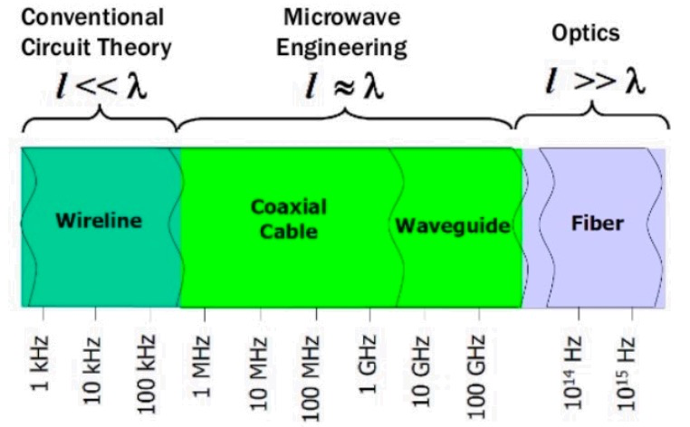

微波的频段一般指 300 MHz- 300 GHz。微波工程可以应用于广播电视、无线通信（如蜂窝网、WLAN及近场无线通信）、卫星通信和雷达等诸多领域。

### 工程电磁场理论

> 电产生于电子的定向移动  磁产生于电子的定向转动
> 
> 恒定的电压和电流也会产生电场和磁场
> 但是如果想要让场传播  我们就需要让电压和电流发生变化

#### 麦克斯韦方程组

麦克斯韦方程组是描述电场和磁场与电荷和电流之间相互作用的基本方程：

1. **Gauss's Law for Electricity:**
   $$
   \nabla \cdot \vec{E} = \frac{\rho}{\varepsilon_0}
   $$
   这个方程描述了**电场散度与体电荷密度**的关系；
   右侧项 $\frac{\rho}{\varepsilon_0}$ 代表电场源自体电荷密度 $\rho$，$\varepsilon_0$ 是真空介电常数。

   > 蹇：往一个屋子里面扔炸弹，能炸出多少东西就说明里面有多少人。

2. **Gauss's Law for Magnetism:**
   $$
   \nabla \cdot \vec{B} = 0
   $$
   这个方程表达了**磁场的散度为零**，即**不存在磁单极子**；
   磁场是一个无源场，没有磁荷。

3. **Faraday's Law of Induction:**
   $$
   \nabla \times \vec{E} = -\frac{\partial \vec{B}}{\partial t}
   $$
   这个方程表示**电场旋度与时变磁场**之间的关系；
   它表达了变化的磁场可以引发涡旋电场。

4. **Ampère's Circuital Law with Maxwell's Addition:**
   $$
   \nabla \times \vec{B} = \mu_0 \vec{J} + \mu_0 \varepsilon_0 \frac{\partial \vec{E}}{\partial t}
   $$
   这个方程描述了**磁场旋度与电流密度及迁移电流**的关系；
   在麦克斯韦的修正中，第二项 $\mu_0 \varepsilon_0 \frac{\partial \vec{E}}{\partial t}$ 表示电场的变化同样会导致磁场的涡旋。

麦克斯韦方程也存在积分形式，可以通过高斯定理和斯托克斯定理推导：
$$
\int_{\text{闭合表面}} \vec{E} \cdot d\vec{S} = \frac{1}{\varepsilon_0} \int_{\text{包络体积}} \rho \, dV
$$

$$
\int_{\text{闭合表面}} \vec{B} \cdot d\vec{S} = 0
$$

$$
\oint_{\text{闭合曲线}} \vec{E} \cdot d\vec{l} = -\frac{d}{dt} \int_{\text{通过曲线的表面}} \vec{B} \cdot d\vec{S}
$$

$$
\oint_{\text{闭合曲线}} \vec{B} \cdot d\vec{l} = \mu_0 \int_{\text{通过曲线的表面}} \vec{J} \cdot d\vec{S} + \mu_0 \varepsilon_0 \frac{d}{dt} \int_{\text{通过曲线的表面}} \vec{E} \cdot d\vec{S}
$$

麦克斯韦方程组是工程电磁场理论的重要内容，是研究微波工程的基石。

#### 边界条件

边界条件研究电磁场在不同电介质界面两侧的关系。

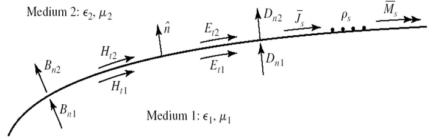

> 研究边界条件对微波工程具有实际意义：
> 开路与短路传输线可以被认为是两种极端的边界条件。

1. **通用边界条件：**

   

   在方程中：n代表法向量；D代表电位移（电场与介电常数之积）；B代表磁感应强度；H代表磁场强度（磁感应强度除以磁导率）。

   以上四个式子分别表明：
   
   - 法向电位移之差等于面电荷密度；
   - 法向磁感应强度相同
- 切向电场强度相同
   - 切向磁场强度差等于面电流密度。

2. **理想导体（电墙，短路传输线末端）：**
   这里假设电导率无穷大，电场在导体内瞬间归零：

   

3. **理想磁墙（实际中不存在，开路传输线末端）：**
   这里假设介质内无电流，界面之间不存在磁通量：

   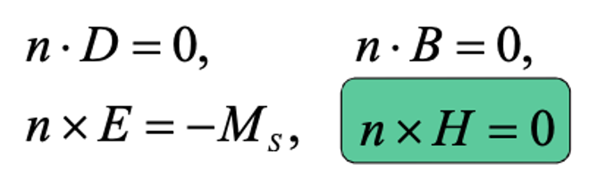

### 微波工程工具

#### 测量仪器：矢量网络分析仪

Vector Network Analyzer，VNA，矢网，网分，是用于分析高频电路信号传输与反射的工具。

过去，人们只能测量端口的功率等信息，即只能分析网络的标量特征；
但现在，人们在测量幅值的同时还能获取其相位信息，即能对电路进行矢量分析。

#### 电路仿真软件：ADS

Keysight Advanced Design System 是一款射频微波信号完整性**电路**建模仿真与优化软件。

#### 电磁仿真软件：CST 与 HFSS

CST 是一款专注于三维电磁场仿真的软件，能进行复杂电磁场和**电磁波**传播的全面建模与仿真；

High-Frequency Structure Simulator 能仿真复杂结构的高频**电磁**特性，应用于微波和毫米波领域。

### 高频电路特性

#### 趋肤效应

高频电磁波倾向于在导体的表面传播，其衰减为$\frac{1}{e}$的深度为**趋肤深度**：

#### 集总与分立

在微波工程中称电阻、电容和电感等实际元件为 **lumped elements**，集总元件。

1. 实际的电阻电路模型如下：

   

   使用ADS仿真上述网络阻抗：

   

   实际电阻在低频阻抗稳定，升高到一定程度呈现容性，谐振点后呈现感性；

2. 实际的电容电路模型如下：

   

   使用ADS仿真上述网络阻抗：

   

3. 实际的电感电路模型如下：

   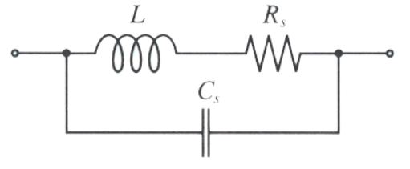

   使用ADS仿真上述网络阻抗：

   

综上所述，集总（lumped）器件不包含任何空间信息，其特点包括：实际的元器件存在寄生效应，等效为多个元器件构成的网络；阻抗的频率响应复杂；存在谐振频率。

与集总对立的是 **distributed elements**，分立器件。其涵盖空间信息，与电磁波波长可比**（超过波长的十分之一）**。传输线就是典型的分立器件，有波导、同轴线和微带线多种形式，其特点包括：导线连接会对电路性能产生影响；通过覆铜底板和传输线设计降低耦合；需要电磁屏蔽。

[Back to the Table of Contents](#Notes on Microwave Engineering)

## Transmission Line Theory

### 概念

#### 研究传输线的意义

当电路尺度与波长相当，电压电流随空间位置不同发生变化，必须把他们看成是传输过程中的波。

因此，在微波工程中，研究传输线理论是必须的，空间坐标上的传输线阻抗函数是有意义的。

> 将传输线直接短路，如左图所示；传输线电压电流随位置关系如中间所示，对两者做除法（并除以特征阻抗归一化）得到阻抗位置函数如右图所示：
> 
> 
> 
> 综上所述：传输线的阻抗是随位置变化的函数。

#### 传输线属性

研究传输线，我们应当关注其物理与电学的诸多属性。

- Physical：
  - 结构：导体与电介质形式；
  - 尺寸：导体与电介质尺寸，电长度是以波长为单位的物理长度；
  - 材料：电导率与介电常数。
- Electrical：
  - 信号传输速率；
  - 传输损耗；
  - 频率响应。

传输线理论是研究高频电路的基础，可以定量分析电磁场传播状况。

传输线是一个**双端口**器件，其具体属性可用**特征阻抗**和**传播常数**概括。

### 高频传输线的等效电路模型

如上文所述，在研究高频信号时，波长与电路尺度相当，我们不能集总地看待传输线。因此，我们需要**化大为小**，让研究的对象继续小于高频信号的波长，从而才能使用传统的电路分析方法拿到微波工程的“入场券”——传输线方程。

上图为高频传输线的等效电路模型，所有物理符号表示单位长度上的电学量。

> 电路中的四个基本量：
> 
>  **符号** | 中文名 | 英文名      | 单位       | 意义                               |
> | -------- | ------ | ----------- | ---------- | ---------------------------------- |
> | **R**    | 电阻   | Resistance  | Ohm, Ω     | 电流所受阻碍                       |
> | **X**    | 电抗   | Reactance   | Ohm, Ω     | 频率相关的阻碍 感正（电流lag）容负 |
> | **G**    | 电导   | Conductance | Siemens, S | 导电能力 电阻倒数                  |
> | **B**    | 电纳   | Susceptance | Siemens, S | 对交流电的感应 感正（电流lag）容负 |
>  
> 阻抗统称**Z**，导纳统称**Y**。
> 在电路中，串联阻抗相加，并联导纳相加。
>  
> 在电路基础中：电阻与电导对应实轴，电抗与电纳对应虚轴；
> 在微波工程中：我们将学习使用更适合高频研究的方式——[史密斯圆图](# Smith Chart and Impedance Matching)对于上述物理量进行坐标映射与变换。

#### 计算模型与传输线方程

在实际计算中，我们只考虑一条线上的寄生效应构建一维传输线微元模型。微元的尺寸已经远远小于波长，我们能够通过基尔霍夫定律进行分析：

> 基尔霍夫电压定律（KVL）：闭合回路，整个一圈电压变化加起来为0；
> 基尔霍夫电流定律（KCL）：流入节点与流出节点电流相同。

我们基于串联（橙色）使用KVL，基于并联（青色）分析KCL，基于微元写出微分形式：

对于微分形式求二阶导，所得方程中包含彼此一阶导，可进行代换：

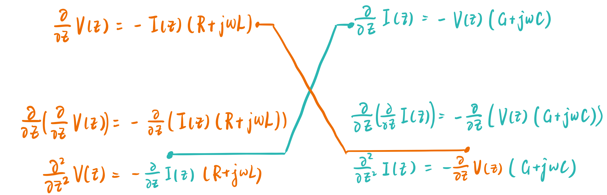

代换后的方程形成了自身与自身空间二阶导的形式，是典型的波动方程。
至此，我们推导出了**空间上的传输线方程**：

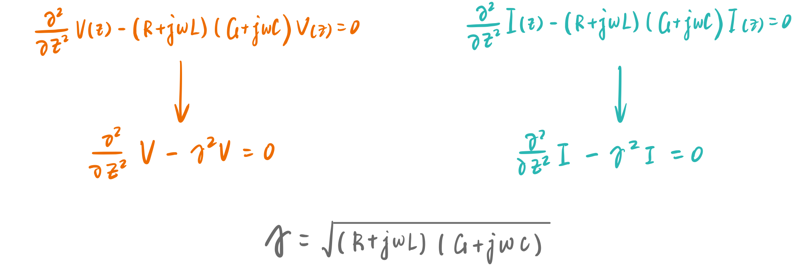

除了对高频信号进行空间分析，我们也可以对其进行时域分析。

在传输线**不存在电阻与极间电导**的前提下，基于空间和时间求二阶导的电压函数存在联系：

波动方程具有行波解——解的形式是沿着正反传播的波，我们推导出**时间上传输线方程的解**：

> 引用了PPT的插图，这里$v = f_0 = \frac{1}{\sqrt{LC}}$。

我们可以将波的行波解进一步表达为：

$$
V(z, t) = V_0 \cdot \exp(j(k \cdot z - \omega \cdot t))
$$

其中波数 $k = \frac{2\pi}{\lambda}$ 定义了波在空间中的传播特性。这里可以进一步引入相速度和群速度的概念，以更完整地描述波的传播特性：

- **相速度** $v_p = \frac{\omega}{k}$，表示波的相位在空间中的传播速度。
- **群速度** $v_g = \frac{d\omega}{dk}$，代表波包在介质中传播的速度。

#### 特征阻抗

不同于传统电路分析中阻抗的概念，特征阻抗定义于电压电流行波的幅值：

> 在微波传输中，特征阻抗不仅可以表示为电压和电流的比值，还可以解释为电场与磁场的比值。尽管期中考试不考察，但是很有意思。
>
> 例如，在自由空间中的真空波阻抗（也称为自由空间特征阻抗）是电磁波在真空中传播时电场和磁场之间的关系。这个特性阻抗决定了电场和磁场的强度比，其单位是欧姆（Ohm），其数值大约为 $377 \, \Omega$。
>
> 具体而言，根据麦克斯韦方程组，我们知道在自由空间（真空）中，电磁波的电场 $E$ 和磁场 $H$ 之间有以下关系：
> $$
> \nabla \times \mathbf{E} = -\mu_0 \frac{\partial \mathbf{H}}{\partial t}
> $$
>
> $$
> \nabla \times \mathbf{H} = \epsilon_0 \frac{\partial \mathbf{E}}{\partial t}
> $$
>
> 这里：
>
> - $\mu_0$ 是真空磁导率（磁常数），大约为 $4\pi \times 10^{-7}$ H/m（亨利每米）。
> - $\epsilon_0$ 是真空电容率（电常数），大约为 $8.854 \times 10^{-12}$ F/m（法拉每米）。
>
> 在真空中，电磁波的传播速度 $c$ 可以由 $\mu_0$ 和 $\epsilon_0$ 推导出来：
> $$
> c = \frac{1}{\sqrt{\mu_0 \epsilon_0}}
> $$
> 将 $\mu_0$ 和 $\epsilon_0$ 的值代入，可以得到光速 $c \approx 3 \times 10^8$ m/s。
>
> 真空波阻抗 $Z_0$ 定义为电磁波在自由空间中电场 $E$ 与磁场 $H$ 的比值：
> $$
> Z_0 = \frac{E}{H}
> $$
> 通过麦克斯韦方程，我们可以进一步得出 $Z_0$ 的表达式：
> $$
> Z_0 = \sqrt{\frac{\mu_0}{\epsilon_0}}
> $$
> 将 $\mu_0$ 和 $\epsilon_0$ 的数值代入上式：
> $$
> Z_0 = \sqrt{\frac{4\pi \times 10^{-7}}{8.854 \times 10^{-12}}}
> $$
> 计算得到：
> $$
> Z_0 \approx 376.7 \, \Omega
> $$
> 通常将其近似为 $377 \, \Omega$。

在后续的学习中：通过研究特征阻抗，我们可以让电路的各个部分更高效地连接。

#### 特殊传输线

在微波工程中，存在着一些特殊的传输线，具有重要的研究价值：

- **微带线：**微带线是一种常用的传输线结构，由导电金属箔-电解质基板-地构成，可以近似地建模为平行板电容器；研究微带线需要考虑微带线本身的材质，长宽，厚度和介质基板的介电性质；

  

  微带线的基材也是重要的研究对象。我们可以通过ADS辅助设计微带线。

- **无损传输线：**即上文中$R = G = 0$的传输线，对于电压波：
  $$
  V(z) = V_+e^{-\gamma z}+V_-e^{\gamma z}
  $$
  

  其中的复指数只有虚部，没有实部。
  也就意味着：电压电流幅值在传播中不会衰减，只是相位发生变化，这就是无损传输线。
  
  在微波工程中，如无特殊说明，传输线即代指无损传输线。

### 电路中的传输线

#### 参数计算

对于以下网络，传输线的特征阻抗为$Z_0$，负载阻抗为$Z_L$：

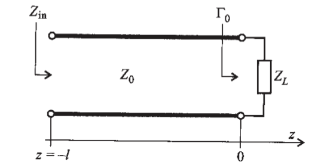

- **电压反射系数：**

  定义从传输线到负载之间的反射系数$Z_0$:

  

  其计算方法为：

  

  对于特殊负载：开路为1，短路为-1（反向），匹配为0。

- **驻波比：**

  高频信号被反射后会形成驻波，定义驻波比：

  

  其与反射系数的关系为：

  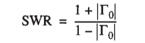

- **传播常数：**

  在等效电路模型的推导中，我们得到了$\gamma$，这就是传播常数：

  

  其实部为衰减系数，虚部为相位常数。对于无损传输线：

  

- **相速度：**

  相速度指电磁波波前等相位点的传播速度，其计算方式和与相位系数$\beta$的关系如下：

  

#### 带负载传输线

- **带负载输入阻抗：**

  对于连接负载的无损传输线，使用含反射分量的电压电流相除得到距离负载$d$处的输入阻抗为：

  

  其中：
  $$
  \beta = \frac{2\pi f}{v_p} = \omega \sqrt{LC} = \frac{2\pi}{\lambda}
  $$

- **负载短路传输线：**

  即$Z_L = 0$：

  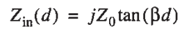

  由于$tan$函数特性，特征阻抗呈现出短路-感性-开路-容性-短路的周期性循环：

  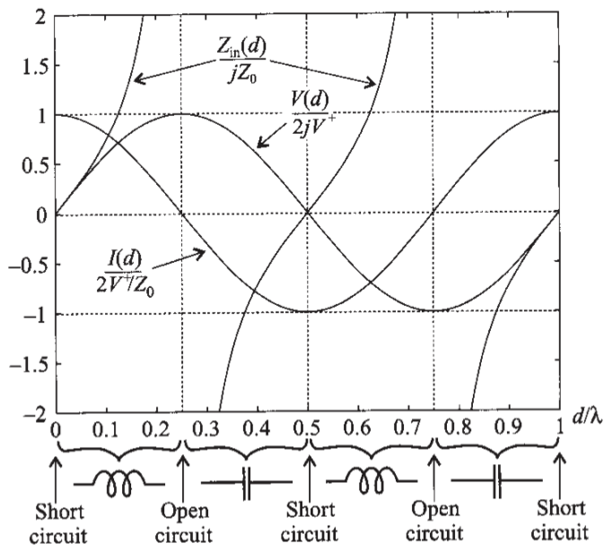

  同样地，当传输线长度确定而频率（波长变化），阻抗幅值也呈现出周期性变化：

  

  通过这些特性，我们甚至可以用传输线来随心所欲地[设计高频电感电容](####导纳变换)！
  ~~尽管他们的值会随频率变化。~~

- **负载开路传输线：**

  即$Z_L = \infin$：

  

  类似于短路情景，开路传输线具有类似的周期性质；

#### 四分之一波长传输线

将四分之一波长带入$d$，恰好可以形成$\tan{(\beta d) = \tan{(\frac{\pi}{2})} = \infin}$，此时：

也就意味着，我们可以通过四分之一波长传输线构成[阻抗变换器](####匹配方式)：
将传输线阻抗设计为两者几何平均值，从而对两个阻抗不相同的网络之间进行匹配！

#### 传输线功率

> 以下内容来自于“2 TL rev”课件，我认为其存在错误：
> 对于复指数信号能量应该乘以二分之一。
> 
> 无论是何种形式的传输线，我们都可以计算出传输线向负载的入射功率：
> 
> 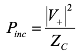
> 
> 和反射功率：
> 
> 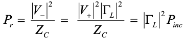

对于低损耗模型，我们可以计算其入射功率与反射功率：

对于无损传输线，我们可以进一步简化，得到**传输线功率表示**：

在计算反射损耗的过程中，我们首先按上文方法计算出反射系数：

此时的反射系数与电压/电流成正比，计算**反射功率**时需要平方，即在对数前乘以二：
$$
RL = -20log_{10}(\Gamma)\ dB
$$

### 实际传输线与波导

#### 模式

模式指电磁场的一种特定分布形式，不同的模式代表传输线中不同的电磁场结构和行为。

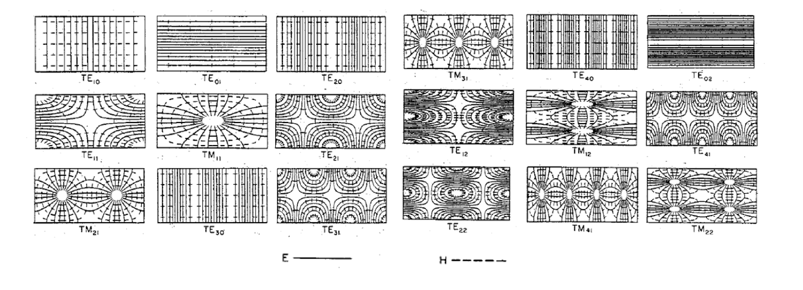

主要的模式有以下几种：

- **TEM模式：**电场和磁场都横向于传输方向，通常是在两个分开的导体中传播（如同轴线）：

  

  其电学量的计算方式为：

  

  TEM模式中没有场沿线方向传播（即$E_z = H_z = 0$），不能在波导中传播；

- 高阶传输线：有场沿着波导方向传播，具体包括：

  - **TE模式：**电场线与电通量垂直于波导方向；
  - **TM模式：**磁场线与磁通量垂直于波导方向。

  TE/TM模式存在纵向传播分量，具有截止频率，截止频率下信号显著衰减：

  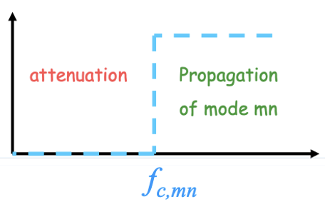

  对于以下物理属性的波导：

  

  其$TE_{mn}$或$TM_{mn}$的**截止频率**为（u指介质光速，m与n为描述场形态的模数，与半波长有关）：

  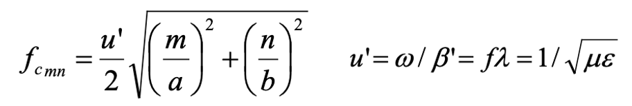

  或者通过波长间接计算：
  $$
  \lambda_c = \frac{2}{\sqrt{(\frac{m}{a})^2+(\frac{n}{b})^2}}
  \\
  f_c = \frac{c}{\lambda_c}
  $$

- **HE综合模式：**波导中同时存在纵向电场和磁场。

#### 应用

- **基于同轴传输线的漏波天线：**可能是地铁信号来源；

  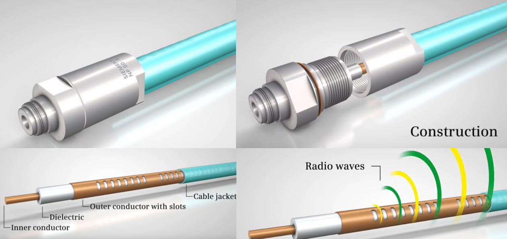

- **基于四分之一波长传输线的单极子天线：**通信设备天线；

  

- **偶极子天线及喇叭天线：**顾名思义；

  

[Back to the Table of Contents](#Notes on Microwave Engineering)

   

## Smith Chart and Impedance Matching

### 概念

史密斯圆图是一种[阻抗（导纳）](###高频传输线的等效电路模型)表达方式。

史密斯圆图（$\Gamma 平面$）比传统的笛卡尔坐标系（$z$平面）更适合表达高频电路频率响应。

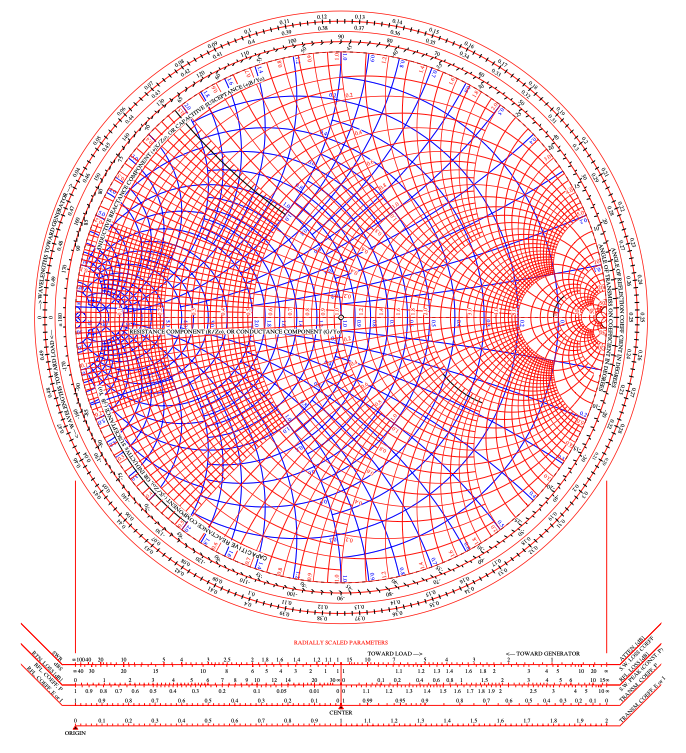

### 从复变量归一化到史密斯圆图

#### 阻抗归一化与圆图坐标

在史密斯圆图中，所有的数值是实际值除以特征阻抗后分归一化值。

对于**阻抗圆图**，其坐标含义为：

- 横轴是实轴表示电阻，从横轴上点出发到右侧的圆为等电阻圆，**左短右开**；

- 圆周是被弯曲的虚轴表示电抗，从右侧发散的曲线为等电抗线，**上感下容**。

  

**导纳圆图**与阻抗圆图相反，在左短右开情况下，左侧导纳无限大（弯折过程中，越密集值越大）：

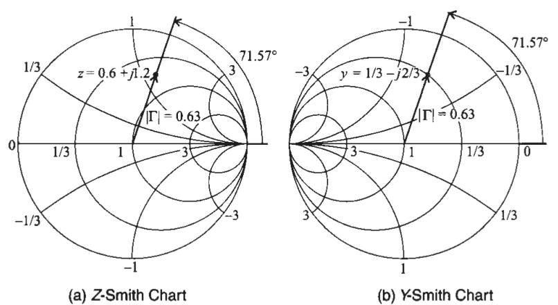

其坐标含义为：

- 横轴是实轴表示电导，**左短右开**；
- 纵轴是弯曲的虚轴表示电纳，**上感下容**（导纳圆图是阻抗圆图转一百八十度）；

阻抗点可以旋转180°换算为导纳点：

> 史密斯圆图的横坐标是反射系数F的实部，纵轴是虚部。
> 里面的圆和圆弧都是方便由负载定位反射系数F的**辅助线**

#### 复反射系数与驻波系数

反射系数是一个复变量，可以写成相量形式（幅值和幅角）：

在史密斯圆图中，中心点（匹配）反射系数为0，半径与反射系数成正比，最外圈反射系数为1：

在得到复反射系数后，我们观察电压驻波系数：

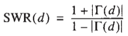

其表达式形式与给定反射系数求阻抗的式子非常接近：

这意味着：
$$
SWR(d) = \frac{Z(d)}{Z_0}
$$
也就是说：驻波系数可以从等反射系数幅值**圆与正实轴的交点**读出！

#### 图解表示法

通过确定$z = x+jy$形式的阻抗，我们可以画出对应阻抗点在圆图中的位置：

电路在一个频点的阻抗是圆图上的一个点，其在一定频率区间内的阻抗频率响应可构成一条曲线：

### 圆图视角下的变换

在这一部分的叙述中，我们使用 ADS 的 Smith Chart Utility 研究添加电路元件对阻抗的变换。

我们设定特征阻抗$Z_0 = 50\ohm$，
研究阻抗点$Z_L = 75+j75\ohm$（归一化$Z = 1.5+j1.5$，$Y = \frac{1}{3}-j\frac{1}{3}$）的变换：

#### 阻抗变换

**阻抗圆图**适合表达串联器件产生的变换：

- **串联R**，沿着等电抗线走向右端开路点：

  

- **串联L**，沿着等电阻圆顺时针转动：

  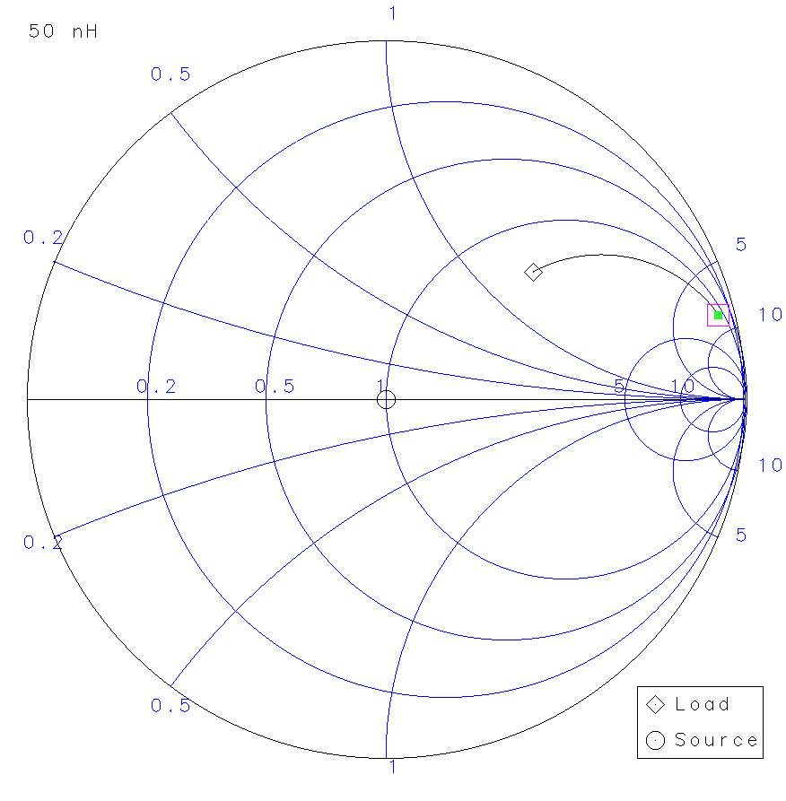

- **串联C**，沿着等电阻圆逆时针转动：

  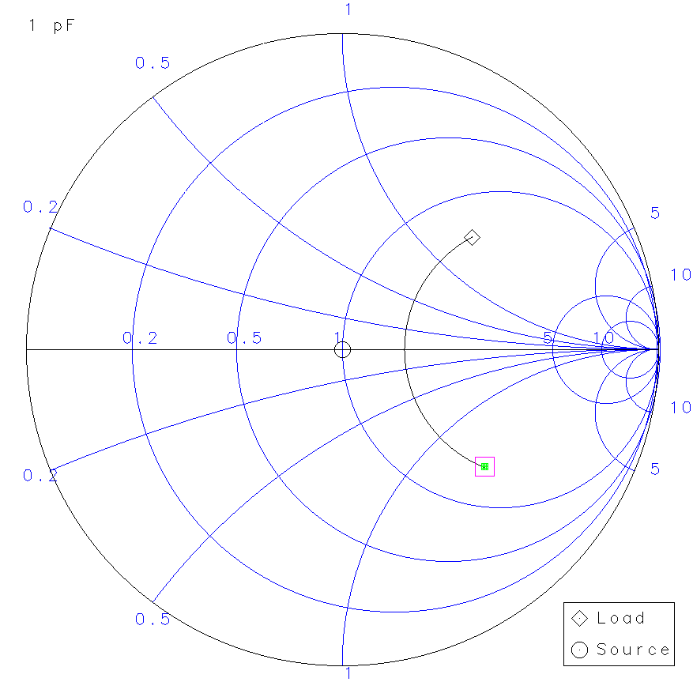

#### 导纳变换

**导纳圆图**适合表达并联器件产生的变换：

- **并联R**，沿着等电纳线走向左端短路点：

  

- **并联L**，沿着等电导圆逆时针转动：

  

- **并联C**，沿着等电导圆顺时针转动：

  

除了使用集总器件，根据[传输线理论](####带负载传输线)，我们可以使用连接支路传输线**（stub）**来实现与并联电感电容类似的效果，（但是传输线的适用频段比集总器件更窄）：

- **短路传输线变换，**等效并联L：

  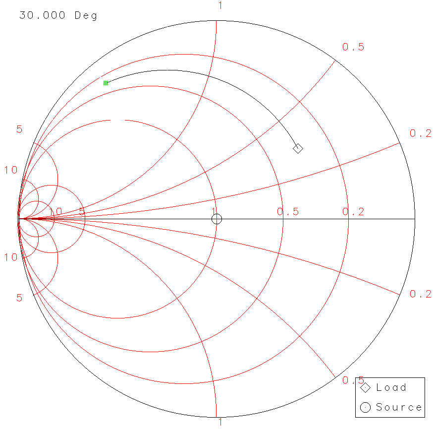

- **开路传输线变换，**等效并联C：

  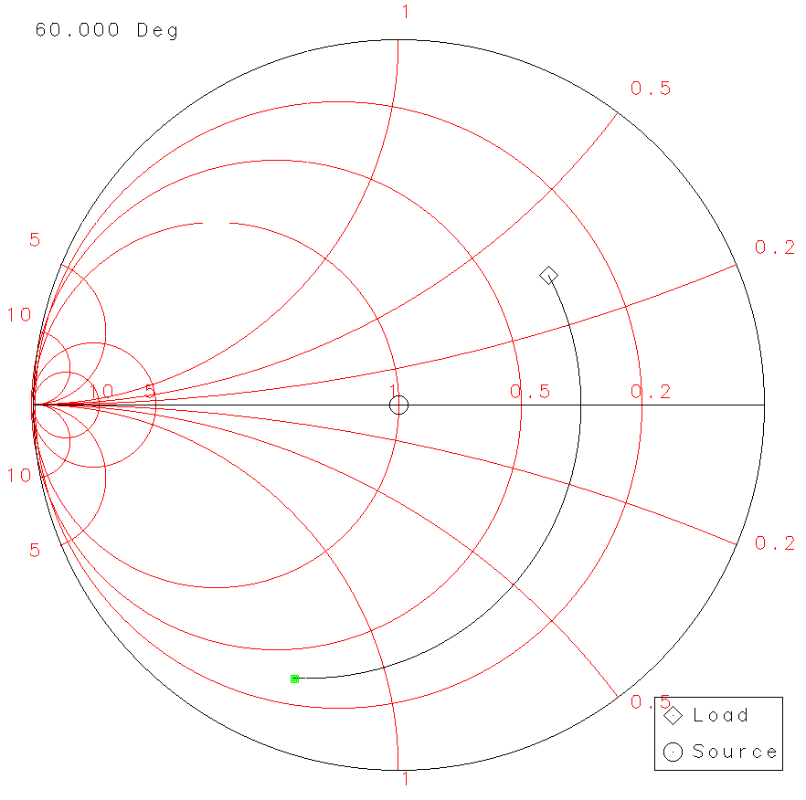

#### 反射系数相位变换

给负载串联传输线**不改变反射系数幅值**，只改变反射系数相位：

- **串联传输线变换，**沿着等反射系数圆顺时针转动：

  

> 变换的综合应用：T型网络
> 
> 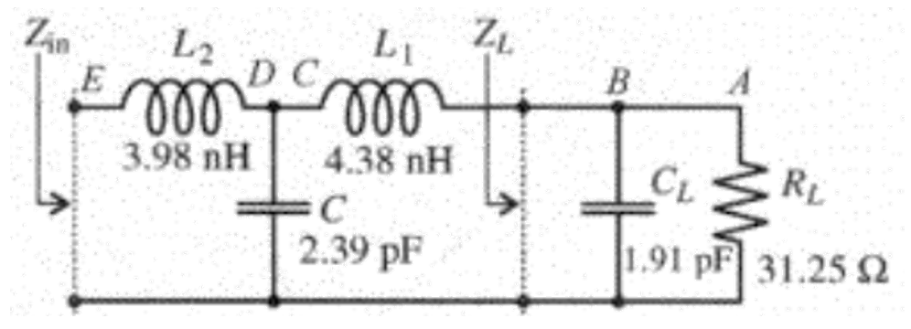
> 
> 通过多重分立器件进行连续变换：
> 
> 
> 
> 此时我们通过一个T型网络将两个不同的阻抗的网络联系在了一起，
> 这就是接下来要讲述的阻抗匹配！

### 阻抗匹配

#### 概念与意义

阻抗匹配是使负载阻抗与源阻抗相互匹配的过程，旨在最大化功率传输与最小化信号反射。

阻抗匹配是阻抗、导纳和反射系数相位变换的实际应用。

#### 匹配方式

- **集总元件匹配：**可用于较宽的频段；
  对于分立器件的阻抗匹配计算：

  |      | 并联 Y                | 串联 X                |
  | ---- | --------------------- | --------------------- |
  | R    | $\frac{1}{R}$         | R                     |
  | L    | $\frac{1}{j\omega L}$ | $j\omega L$           |
  | C    | $j\omega C$           | $\frac{1}{j\omega C}$ |

- **传输线匹配：**仅用于较窄的频段；
  使用[四分之一波长传输线](####四分之一波长传输线)构成阻抗转换器，对于两个不同阻抗的电路进行匹配。
  在匹配时，传输线阻抗应该等于源阻抗与负载阻抗的几何平均值。

  

  在实际应用中，首先用开路/短路传输线的电抗消除负载虚部，然后使用四分之一波长传输线进行实部匹配。

- **半分立匹配：**同时包含集总器件与传输线。

[Back to the Table of Contents](#Notes on Microwave Engineering)

## Networks Analysis

### 概念

#### 端口

端口是**一对**将内部电路连接至外部电路的节点。

#### 网络

网络是一个电路**黑箱**，我们不需要研究其具体结构，只需分析其输入输出特性参量。

- **单端口网络：**如电源；

- **双端口网络：**如变换器与晶体管；
- **三端口网络：**如功分器，环路器；
- **四端口网络：**如相移耦合器。

### 参量

参数是描述网络特性的矩阵。双端口网络系统可用2×2矩阵描述。

#### Z参量：阻抗关系

Z参量实现电流向电压的变换：

其计算方式为：

#### Y参量：导纳关系

Y参量实现电压向电流的变换：

其计算方式为：

Y参量是Z参量的逆。

#### ABCD参量：输入电压电流与输出电压电流关系

ABCD参量实现输出电压电流向输入电压电流的变换：

其计算方式为：

常见电路结构的ABCD参量计算式为：

#### h参量：混合参量

h参数告诉我们输入和输出之间的电压和电流关系，这对于设计和分析放大器电路非常有帮助：

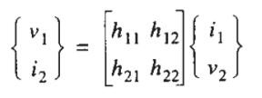

参数计算举例：

至此我们掌握了四个参量，四个参量之间可以转换：

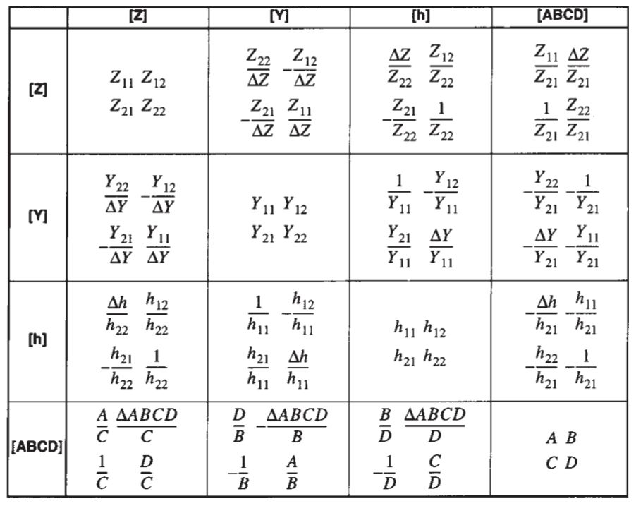

### 网络的级联

ABCD参量适合于表述级联网络。级联网络的ABCD参量是两网络自身ABCD参量的矩阵乘法：

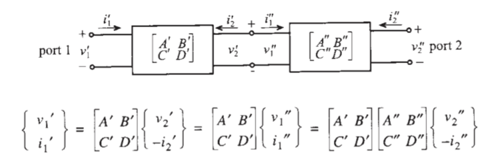

[Back to the Table of Contents](#Notes on Microwave Engineering)

## Scattering Parameter

### 概念

#### 研究S参数的意义

传统的网络参量在射频研究中具有局限性：

- 高频电压电流难以测量；
- 传统参量要求在开路/短路条件下测量，高频电路很难实现理想的开路与短路；
- 有源设备在开路短路测量条件下可能会不稳定。

研究S参数，可以在不为难**DUT**（待测器件）的前提下用双端口网络分析方法确定器件特性。

#### S参数的概念

S参数表示网络中：

- 端口的电压/电流反射比例；
- 端口电压/电流传输到其他端口的比例。

> S参数是与电流/电压成正比的量，其平方与功率成正比；
> 但是《RF Circuits Design》用“power wave”称呼S参数的入射与反射波，
> 不符合实际概念。
> 
> 在其中文译本和本笔记中，我们将用“电压波”替代“功率波”进行讲述。

### S参数的计算

#### S参数的定义

首先，对入射（i）和反射（r）的电压波除以根号下特征阻抗进行归一化：

根据输入输出归一化电压波的关系，我们定义S参数矩阵：

在这里，$S_{mn}$的求法和物理意义是：

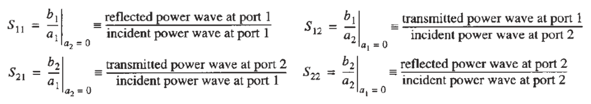

#### S参数的物理意义

S参数矩阵有着丰富的物理意义：

- **电压电流与S参数的关系：**

  利用电压与电流波计算归一化波，n表示端口：

  

  然后，通过上述求法即可得到S参数矩阵：

  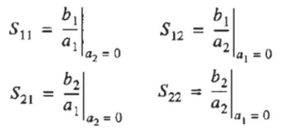

  相反，我们可以用归一化能量求出波的电流与电压：

  

- **S参数与反射系数和驻波比的关系：**

  对于$S_{11}$（$S_{22}$同理），其物理意义是输出端口完全匹配时输入端口的回波与输入波之比，
  也就是网络在输入端口处的反射波与入射波之比，
  这是反射系数！

  

  有了反射系数，我们也就能求出驻波比：

  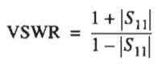

  对其模取对数，乘以**-20**（因为S参数平方才与功率成正比，相应地对数从乘-10变成乘-20）即可得到**反射损耗**：

  

- **S参数与功率：**

  - 归一化电压波与传输功率：

    归一化波的量纲是$W^{-1}$。例如$a_1$（其余同理），我们将其平方除以二即可求出入射功率：

    

  - 端口总功率：

    例如1端口（其余同理），我们可以通过入射波平方除以二减去反射波平方除于二即可求出端口上的总功率，这一过程也可以通过入射波功率减去其乘以反射系数平方的积完成：

    

- **S参数矩阵各项意义：**

  - $S_{11}$和$S_{22}$：如上所述，是反射系数；
  - $S_{12}$和$S_{21}$：分别是正向增益电压和反向增益电压。

#### 级联网络的S参数

若考虑级联网络，则需要重写列向量，将输入放在一侧，输出放在一侧，类似于ABCD参量形式：

此时，级联类似于ABCD，可以直接相乘：

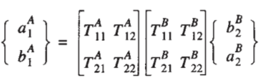

#### S参数与其他参量转换

本质上是矩阵变换。

这里直接可以参考课本附录：

### S参数的性质与推广

#### S参数性质

> S参数矩阵对角表示反射，其余表示传输；
> 
> S参数脚标后者为输入，前者为输出。

- **互易，GRE 中 reciprocal 亦作互益：**

  对于各向同性材料制成的无源器件有$S_{21} = S_{12}$；

- **能量守恒：**

  S参数矩阵为厄米特矩阵，其与自身共轭转置积为单位矩阵：$S^†\times S = I$；

- **三端口匹配无损互益网络不存在：**

  以上两条性质使三端口匹配无损互益网络数学和物理上无法成立；

- **四端口匹配无损互益网络存在：**

  两个无源器件实现了这一点：

  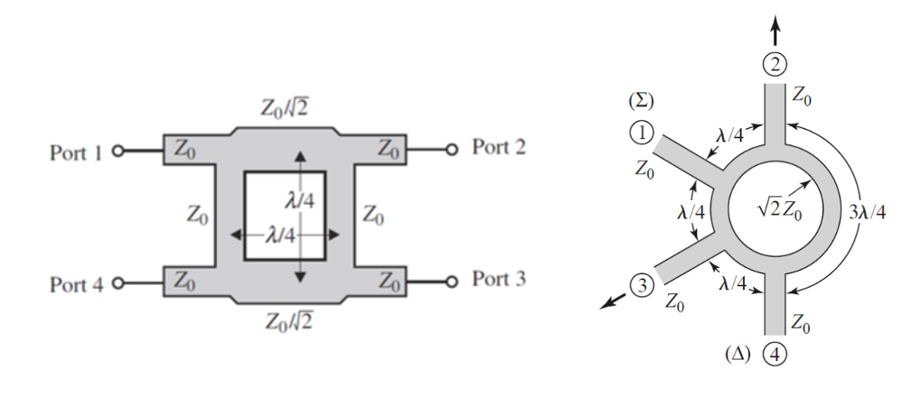

#### S参数推广

- **考虑无损传输线：**

  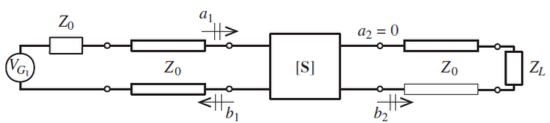

  如果在测量过程中引入无损传输线，则信号会发生相移，S参数矩阵会乘两个新矩阵：

  

  也可以用整理后的矩阵表示：

  

- **高次拓展：**几个端口就是几阶矩阵；

  

### S参数的测量

可以使用VNA（矢量网络分析仪）测量S参数：

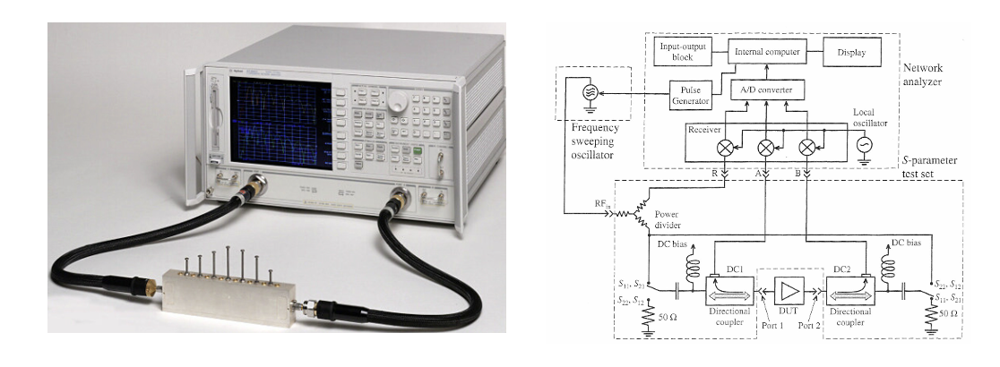

使用前需要进行校准：

- Short, Open, Load, Thru;
- Thru, Reflect, Line;
- E-cal：一个小玩意，很好用，通过串口连接VNA，器件内部跑上述检测，但是很贵。

测试平台通常有两种：

我们本学期将使用小型化 VNA，除此之外，基于 SMA 接口对器件进行测量的 VNA 也十分常见。
基于探针平台的 VNA 可以对 DUT 进行 on wafer 测试，这对于研究微纳射频器件具有重要意义。

>  **S参数的测量是一项非常有意义的工作。**
>
> 例如，我们可以通过测量器件的S参数来研究器件的高频特性，基于测量数据和模型建立器件的紧凑模型 (Compact Model)。
>
> 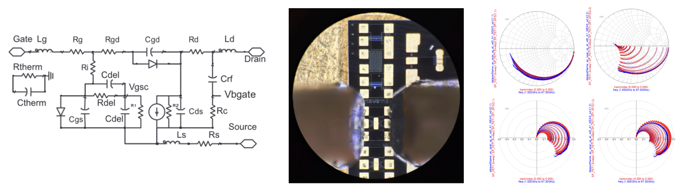
>
> 器件紧凑模型可以高速运行，有效地拟合器件的DC与RF特征，对于将射频器件应用于电路设计有重要意义。

[Back to the Table of Contents](#Notes on Microwave Engineering)

## 微波器件的分析与设计

### 面向器件的网络分析

对于二端口网络：波，电压电流和阻抗的关系如下所示：

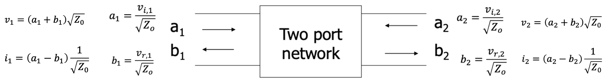

利用波，我们可以定义 S 参数：

> **S参数具有物理意义：**
>
> 根据上述定义式进行理论分析：
>
> - **S11：**从1到1的散射——当从2没有入射（1激励、2匹配）时，1出射与1入射的比值；
> - **S21：**从1到2的散射——当从2没有入射（1激励、2匹配）时，2出射与1入射的比值；
> - **S12：**从2到1的散射——当从1没有入射（2激励、1匹配）时，1出射与2入射的比值；
> - **S22：**从2到2的散射——当从1没有入射（2激励、1匹配）时，2出射与2入射的比值。
>
> 我们可以借助 VNA 的测量过程理解这一过程：
>
> 
>
> - 当仅测量S11时（左），Port1指示灯亮，代表 VNA 从1端口给激励，2端口匹配，从1端口测量反射波判定S11；
> - 当同时测量S11和S21时（中），依然只是Port1亮灯，代表 VNA 从1端口给激励，2端口匹配，从1端口测量反射波判定S11，从2端口测量散射波判定S21；
> - 当同时测量S11和S12时（右），Port1和Port2指示灯交替闪烁，代表VNA时分复用地调整入射与激励端口——激励1匹配2测量S11，激励2匹配1测量S12。

S参数与电压/电流成正比，其平方与能量/功率成正比。将S参数化成分贝表示的过程中，需要给对数前乘以系数20，表示能量/功率的对数表示，比如从端口1到端口2的传输增益：
$$
Gain = 20lg(S_{21})
$$
对于反射能量，通常不讲Gain而讲Loss，比如1端口的反射损耗可以表示为：
$$
RL - 20lg(S_{11})
$$
常用的数据：当$S_{11}= 0.1$，$dB(S_{11})= -20$，此时99%的能量都进入了网络。
我们可以进一步定义 S 参数矩阵，更清晰地表示各个端口波的散射关系：

S参数矩阵是我们研究器件性能的重要工具。

#### 器件性质

- **匹配：**在其他端口全部匹配的前提下，所有端口的反射系数为0，

  反映在S参数矩阵：S参数矩阵对角全部为0；

- **无损：**所有传输进网络的能量最终都传出网络，网络不吸收任何能量，不会产热，

  反映在S参数矩阵，S为unitary matrix，S矩阵和他的共轭转置相乘为单位矩阵，$S^HS = I$；

- **互易：**所有端口正反S参数相同，

  反映在S参数矩阵，S为对称矩阵，转置等于自己，$S^T=S$。

#### 四端口无损互易匹配网络

==对于无源器件==，无损互益匹配三端口网络在数学上不存在，

但是四端口器件是存在的，这就是耦合器的数学模型。

在数学上，符合条件的模型具有两个通解： 

1. **对称结构：**S参数矩阵幅值两个变量，相位相差90度

   

   与这种结构对应的是分支线耦合器：

   

2. **反对称结构：**S参数矩阵幅值两个变量，$\beta$分别为0和180°

   

   与这种结构对应的是仓鼠轮耦合器（3和4标反了）：

   

由于需要满足无损，则上述$\alpha$和$\beta$模平方和一定。

### 参量矩阵

#### 常见结构的ABCD矩阵

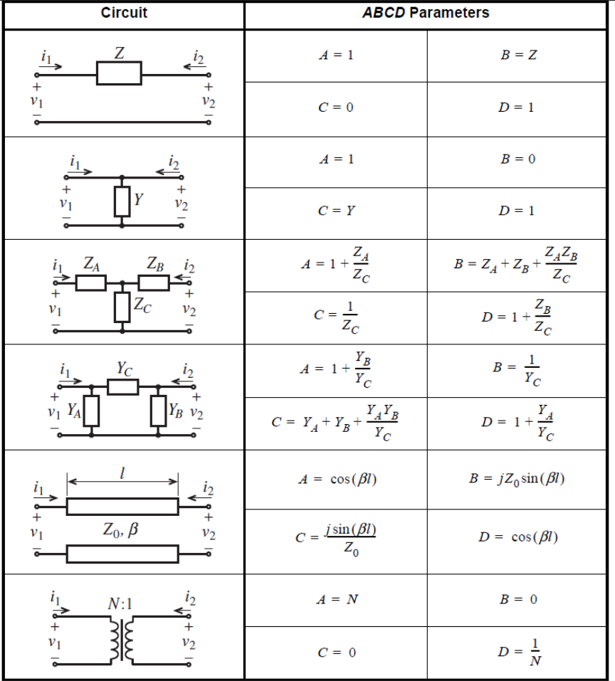

> 值得注意的是：
>
> 对于传输线的ABCD矩阵，单根-地和并行两根都是相同的。
> 对于四分之一波长传输线，ABCD矩阵为：
> $$
> \begin{bmatrix}
> 0 & jZ_0 \\
> \frac{j}{Z_0}& 0
> \end{bmatrix}
> $$

#### 矩阵变换

- 常用矩阵转S参数

  

- S参数转常用矩阵

  

### 奇偶模

奇偶模是基于对称性的电路分析方法。

在我们需要研究的端口上，任何激励都可以被分为奇偶两部分。我们可以电路的对称轴将其分解为等效的几部分，在需要研究的端口上分别添加偶激励与奇激励。在奇偶激励下，电路在对称轴上的切口有以下特征：

- 对于偶激励，电路沿对称轴上没有电流，视作虚断（切口悬空）；
- 对于奇激励，电路沿对称轴上电流直通，视作虚短（切口接地）。

奇偶模分析的大致研究方法如下：

- 奇偶模分析：

  - **构建对称模型：**给14两个端口分别加奇偶激励，结构从中间对称。将模型中分传输线分成上下两个部分，上下两个部分分类讨论。写出上半部分S参数和激励之间的关系，

  - **奇偶模分类讨论：**偶模对称，中间相当于段路（悬空）；奇模贯穿，中间相当于短路（接地）。分析上半部分电路中各个部分的阻抗，利用阻抗导出ABCD矩阵，

    ABCD矩阵计算过程中需要对阻抗进行归一化，认为Z0=1，传输线Zc的系数需要带入计算。

  - **求解整个电路：**根据上半部分S参数矩阵求整个电路的S参数矩阵。

[Back to the Table of Contents](#Notes on Microwave Engineering)

## 无源器件

无源器件是一系列器件的统称，常见的无源器件包括以下内容。

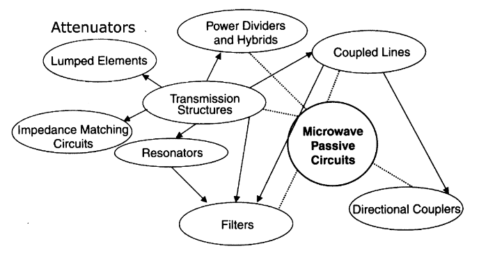

> 将 Passive Circuits 译作“被动器件”属于是台湾风味。

### 功分器与耦合器

> 这一部分是下半学期的重中之重，需要掌握**定性与定量**分析方法。
> **这一部分的奇偶模分析一定要掌握！**

功分器与耦合器是非常重要的无源器件，他们可以用来进行功率的分配与合成。

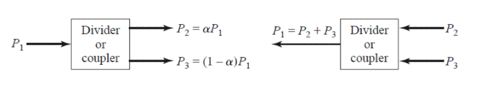

耦合器通常包含四个端口：输入，直出，耦合，隔离。耦合器工作时呈现出方向性，即面对不同的输入，不同的端口呈现出的功能不同：

我们可以用S参数算出耦合器的性能指标：

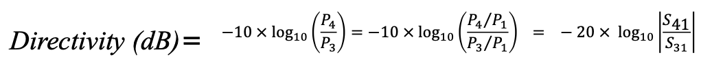

#### Wilkinson 功分器

是一个三端口匹配无损器件：

他不互易：

#### 分支线耦合器

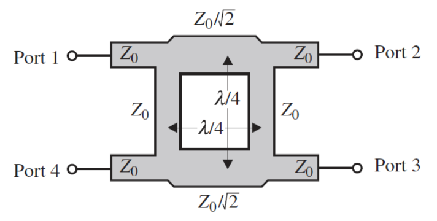

四段传输线构成的耦合器。

求得S参数矩阵如下：

可以看出分支线耦合器的功能如下：

- 从1入射的信号可以被均分至2和3，插入损耗为3dB；
- 理想状态下从4流出的能量为0；
- 信号之间的相位差90°。

分支线耦合器有着广泛的应用：

- 均衡放大器：需要两个相同的放大器，使放大器获得更小损耗、更大增益和更平稳的带内表现。
- 可变移相器：
- 可变衰减器：
- 相控阵天线：
- 球形天线的馈电网络：

#### 仓鼠轮耦合器

类似于仓鼠轮形状的环形耦合器。

与之对应的S参数矩阵如下：

可以看出：

- 从1入射信号：
  - 信号从2和4中均分流出；
  - 信号相位差180°（相反数）；
  - 理想状态下，3中没有信号流出。
- 从3入射信号：
  - 能量从信号从2和4均分流出；
  - 信号相位差0°；
  - 理想状态下，1中没有信号流出。

仓鼠轮耦合器可以用于功率的定向分配，同时实现通信系统的收发功能：

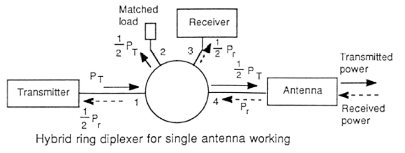

> 常见的耦合器还包括谐振定向耦合器和 Lange 耦合器。

### 谐振器

> 这一部分是实际工程问题中的重点，是许多其余器件的基础；
> 值得掌握**定性与定量**分析方法。

谐振器是一种让微波信号在器件内形成驻波的信号的电路。

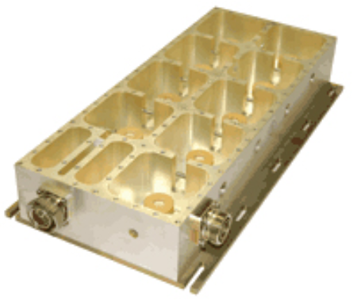

> 谐振器与驻波，就像是用微波炉加热奶酪。

**谐振器有着丰富的应用：**

- **滤波器：**只通过特定频率的信号；
- **振荡器：**产生并放大微波信号；
- **频率计：**用于测量信号的频率；
- **调谐放大器：**增强特定频率的信号。

#### RLC谐振器原型

谐振器的原形就是LC振荡器，理想的LC振荡器中，总能量不会衰减，能量在电容的电场和电感的磁场间不断转换：

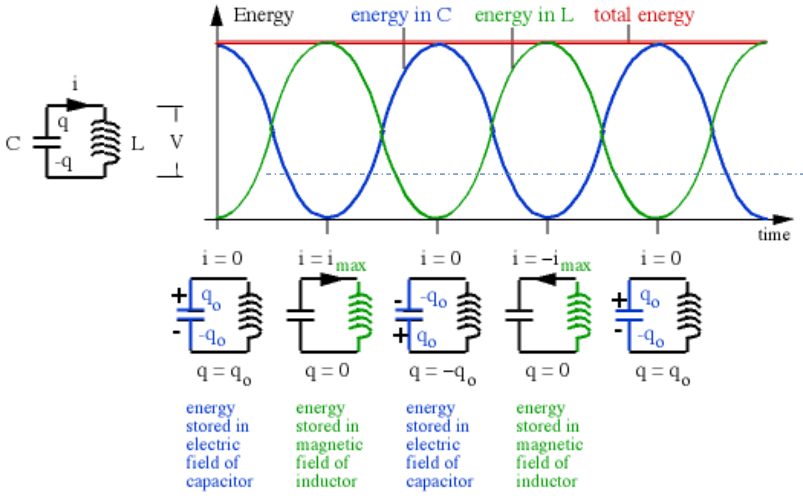

> **研究振荡器过程中过程中，需要着重考虑以下问题：**
>
> - 谐振频率如何计算？
> - 对于微带线振荡器：
>   - 频率和微带线长度之间的联系？
>   - 谐振模式是什么？
>   - 加不加截止？
>   - Q 值的概念是什么？

在电路中串联或并联电阻R，即可构成RLC震荡电路：

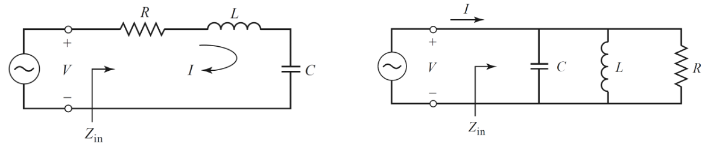

- **对于串联RLC：**

  - 输入阻抗：

    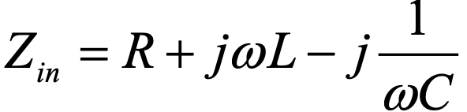

    可以化简为：

    

  - 输入功率：

    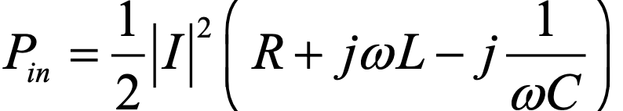

    

    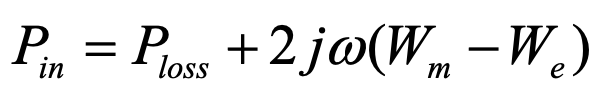

  - 谐振条件和频率：

    

  - Q值：形容存储能量和损失能量之比；

    

    可以通过减小电阻来提高Q值；

  - 带宽：输入阻抗达到谐振的$\sqrt2$倍，此时能量为谐振时的二分之一；

    

    **带宽是1/Q！**

- **对于并联RLC：**

  - 输入阻抗：

    

  - 输入功率：

    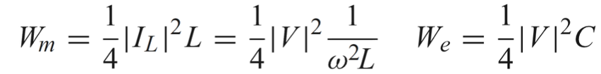

    

  - 谐振条件和频率：

    

  - Q值：

    

  - 带宽：Q分之一。

    

所有写真参数整理如下：

#### 微波谐振器

微波谐振器有着相当多的类别：

- **传输线谐振器：**是基于传输线构成的谐振器，根据传输线波长的不同有三种类型：

  与通过LC计算谐振频率不同，我们可以通过电长度计算和频率推导出线长。
  例如，对于半波长传输线，微带线传输线的线长为：
  $$
  l = \frac{\lambda}{2} = \frac{c}{2f\sqrt{\varepsilon_r}}
  $$

  - 短路（SC）半波长：等效串联RLC；

    

    波在传输线中的传输模式：

    

    传输线特征阻抗基本为实，长度基本为半波长，频率差异不大的前提下，**输入阻抗**为：

    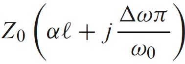

    基于类比，我们可以计算出传输线**等效的RCL**：

    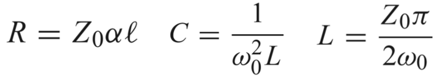

    我们可以计算出**Q值**：

    

  - 开路（OC）半波长：等效并联RLC；

    

    波在传输线中的传播模式：

    

    化简的**输入阻抗**：

    

    **等效RCL：**

    

    我们可以计算出**Q值**：

    

  - 开路（OC）四分之一波长：等效并联RLC。

  > **微带线谐振器的计算包含以下部分：**
  >
  > - **微带线计算：**通过特征阻抗，基板厚度，介电常数求出线宽和等效介电常数；
  >
  > - **计算线长：**通过等效介电常数求出波长，波长线长直接相关：
  >   $$
  >   l = \frac{c}{2f\sqrt{\varepsilon_r}}
  >   $$
  >   例如，线长是半波长，线长是四分之一波长等；
  >
  > - **计算Q值：**基于传输系数
  >
  >   - 求β：这里可以用2π除以波长；
  >
  >   - 求α：是传输系数实部，定义式如下，这个很复杂，如果有多个应该是加起来：
  >
  >     
  >
  >   - 求Q：$Q = \beta/2\alpha$。

- **矩形波导腔谐振器：**

  谐振频率：

  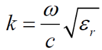

  

  多个Q的合成：

  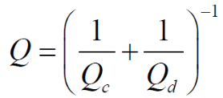

- 除此之外，还有**圆柱波导腔谐振器**和**电介质谐振器**等谐振器

#### 谐振器的耦合

谐振器需要通过不同的方式注入激励。

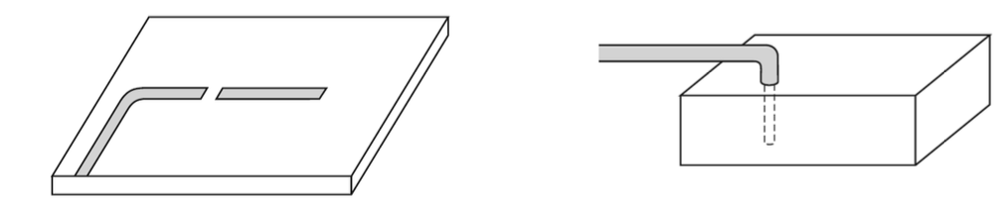

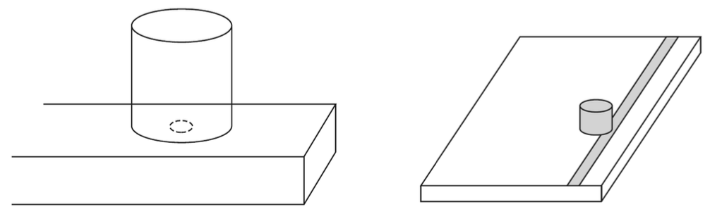

**耦合的效果可以用耦合系数g表示：**

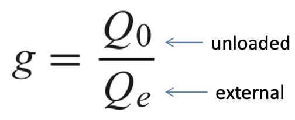

- g < 1，欠耦合；
- g = 1，精准耦合；
- g > 1，过耦合。

精准耦合时：

**耦合方式主要有以下几种：**

- **传输线谐振：**馈线与微带线间隔传递激励；
- **矩形谐振：**同轴线传入激励；
- **圆柱谐振：**通过“光圈”结构引入激励；
- **电介质谐振器：**馈线直接耦合。

### 衰减器

> 也就是 T 型网络，需要掌握**定性与定量**分析方法。

衰减器是一种基于有损器件的网络，能够实现输入输出能量的衰减：

衰减器的S参数矩阵如下：

可以看出：

- 会对于信号进行比例为A的衰减；
- 输入输出匹配

常见的衰减器有着较大的带宽，其插入损耗的计算式为：

同理，我们可以通过10的指数求出衰减的实际幅值：
$$
A = 10^{-AdB/20}
$$
常用的衰减器有两种结构：T形和π形，我们可以分别进行定量运算：

### 环路器

> 这是一种基于铁氧体材料的器件。

环路器是一种无损匹配三端口网络，他不匹配。

其功能主要是让1的能量从2出射，2的能量从3出射，3的能量从1出射。

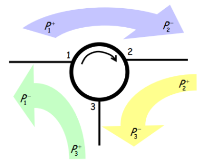

器件的S参数矩阵如下：
$$
\begin{bmatrix}
S_{11} & S_{12} & S_{13} \\
S_{21} & S_{22} & S_{23} \\
S_{31} & S_{32} & S_{33} 
\end{bmatrix} = \begin{bmatrix}
0 & 0 & 1 \\
1 & 0 & 0 \\
0 & 1 & 0 
\end{bmatrix}
$$

### 滤波器

> 滤波器是一门专门的研究生课程，相当有挑战性。

**设计器件有以下层级：**

1. **数学层：**多项式与近似；
2. **电路层：**基于传统电路理论的电路设计；
3. **分立层：**基于传输线的设计；
4. **物理层：**基于电磁场的仿真；
5. **优化层：**实际器件的优化。

设计滤波器是设计低通滤波器原型，再把他变换到需要的频段里。

> 因为因果性限制，理想低通不存在——这需要用负时间。 

[Back to the Table of Contents](#Notes on Microwave Engineering)

## 有源器件

### 放大器

> 这一部分非常重要，需要掌握**定性与定量**分析方法。
> **放大器的增益，一定要掌握！**

放大器是基于射频有源器件的放大电路。设计放大器的大致流程如下：

#### 稳定性分析

- 条件稳定：

  > 一定要理解稳定性圆，会**读稳定性圆图**。

- 无条件稳定： 

  - K-$\Delta$检验：

    

    

  - $\mu$检验：

    

#### 增益计算

> 好的微波放大器，几个增益基本一致。
>
> 对于实际场景：商家可能会提供一个general的增益供你选择。

### 射频开关

> 这一部分仅需了解概念。

#### 微波二极管

是一种有源器件，其性能取决于

- 半导体物理特性
- 器件的封装

射频二极管本质上是电压控制的电阻和电容。

> **需要强调的是：**
>
> 射频开关属于半导体器件，是有源器件！
> 有源器件可以同时实现无损、互易、匹配。

#### 结构与特征

射频开关在电路中有两种结构，串联式和并联式：

他们在性能上存在着一定差异：

基于射频开关，我们可以构建时分复用系统：

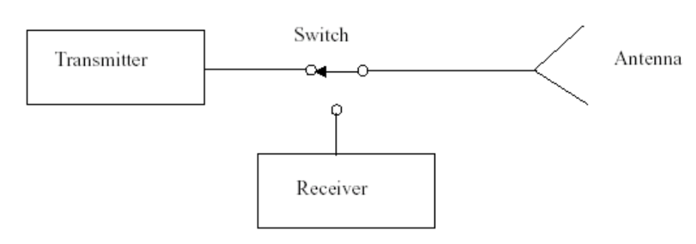

### 移相器

> 这一部分仅需了解概念。

顾名思义，对输入输出信号的相位进行移动：

基于可控移相器的天线阵列可以控制发射波前的方向，实现电磁波赋性，可以不通过机械运动只通过固态阵列与电子控制实现扫描，这就是相控阵雷达。

[Back to the Table of Contents](#Notes on Microwave Engineering)
