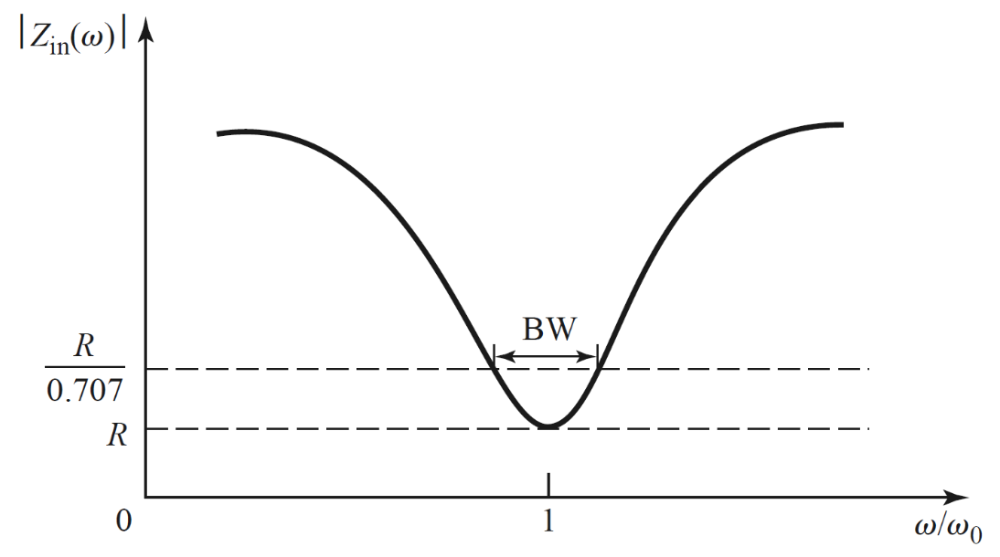
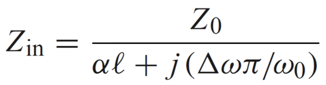
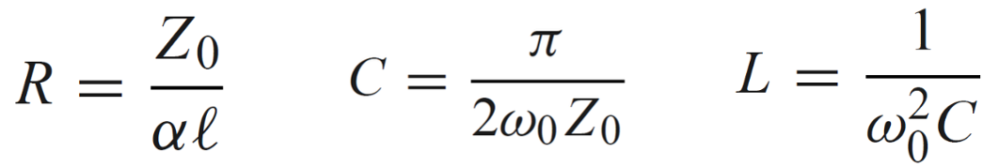
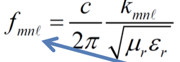
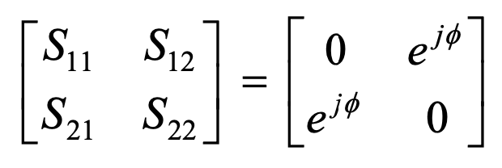

# Notes on Microwave Engineering

Eliot (Tianyang) Chen | Compiled-2023FA | Revised-2024FA

> For the original `.md` file and updated versions of this document, please refer to GitHub:
>
> 
>
> 
https://github.com/EliotChen8/Enlightenment-Exchange/tree/main/2023/SUSTC-EE316-MicrowaveEngineering/notes/part_1

>
> This document is part of the `Enlightenment-Exchange` open-source knowledge-sharing project, aimed at collaborative learning and advancement.

> The table of contents includes hyperlinks for navigation.

[TOC]

> This document summarizes the content covered during the first half of the *Microwave Engineering* course.

> The structure primarily follows the lecture slides of Prof. Ming Yu (Fall 2021 version).
> Some content is additionally referenced from *RF Circuit Design* and *Microwave Engineering* textbooks.

## Introduction

### Concepts

Microwave engineering primarily focuses on the analysis and design of high-frequency circuits.

The microwave frequency range generally refers to 300 MHz to 300 GHz. Applications of microwave engineering include broadcast television, wireless communications (such as cellular networks, WLAN, and near-field wireless communication), satellite communications, and radar systems.

### Electromagnetic Field

> Electricity is generated by the directional movement of electrons, and magnetism is generated by their directional rotation.
>
> Constant voltage and current also produce electric and magnetic fields. However, for the fields to propagate, we need to induce variations in the voltage and current.

#### Maxwell's Equations

Maxwell's equations are the fundamental equations describing the interaction between electric and magnetic fields and charges and currents:

1. **Gauss's Law for Electricity:**
   $$
   \nabla \cdot \vec{E} = \frac{\rho}{\varepsilon_0}
   $$
   This equation describes the relationship between the **divergence of the electric field** and the **volume charge density**. The right-hand term, $\frac{\rho}{\varepsilon_0}$, represents that the electric field originates from the charge density $\rho$, where $\varepsilon_0$ is the permittivity of free space.
   
   > Throwing a bomb into a room shows how much content there is based on how much gets blown up.
   
2. **Gauss's Law for Magnetism:**
   $$
   \nabla \cdot \vec{B} = 0
   $$
   This equation states that the **divergence of the magnetic field is zero**, implying that **magnetic monopoles do not exist**. The magnetic field is a source-free field with no magnetic charges.
   
3. **Faraday's Law of Induction:**
   $$
   \nabla \times \vec{E} = -\frac{\partial \vec{B}}{\partial t}
   $$
   This equation expresses the relationship between the **curl of the electric field** and a **time-varying magnetic field**. It indicates that a changing magnetic field induces a circulating electric field.
   
4. **Ampère's Circuital Law with Maxwell's Addition:**
   $$
   \nabla \times \vec{B} = \mu_0 \vec{J} + \mu_0 \varepsilon_0 \frac{\partial \vec{E}}{\partial t}
   $$
   This equation describes the relationship between the **curl of the magnetic field** and **current density and displacement current**. In Maxwell's modification, the second term $\mu_0 \varepsilon_0 \frac{\partial \vec{E}}{\partial t}$ indicates that a changing electric field also generates a circulating magnetic field.

Maxwell's equations also have an integral form, which can be derived using Gauss's theorem and Stokes' theorem:

$$
\int_{\text{closed surface}} \vec{E} \cdot d\vec{S} = \frac{1}{\varepsilon_0} \int_{\text{enclosed volume}} \rho \, dV
$$

$$
\int_{\text{closed surface}} \vec{B} \cdot d\vec{S} = 0
$$

$$
\oint_{\text{closed loop}} \vec{E} \cdot d\vec{l} = -\frac{d}{dt} \int_{\text{surface}} \vec{B} \cdot d\vec{S}
$$

$$
\oint_{\text{closed loop}} \vec{B} \cdot d\vec{l} = \mu_0 \int_{\text{surface}} \vec{J} \cdot d\vec{S} + \mu_0 \varepsilon_0 \frac{d}{dt} \int_{\text{surface}} \vec{E} \cdot d\vec{S}
$$

Maxwell's equations are crucial in engineering electromagnetic field theory and form the cornerstone of microwave engineering research.

#### Boundary Conditions

Boundary conditions study the relationships of electromagnetic fields at interfaces between different media.

> Studying boundary conditions has practical implications in microwave engineering: open and short transmission lines can be considered two extreme boundary conditions.

1. **General Boundary Conditions:**

   

   In these equations: \( n \) represents the normal vector; \( D \) represents electric displacement (electric field multiplied by permittivity); \( B \) represents magnetic flux density; \( H \) represents magnetic field strength (magnetic flux density divided by permeability).

   These four equations respectively indicate:

   - The difference in normal electric displacement equals the surface charge density.
   - The normal component of magnetic flux density is continuous.
   - The tangential component of the electric field is continuous.
   - The difference in tangential magnetic field strength equals the surface current density.

2. **Ideal Conductors (Electric Wall, Short-circuited Transmission Line):**
   Assuming infinite conductivity, the electric field inside the conductor is instantly zero:

   

3. **Ideal Magnetic Wall (Nonexistent in Practice, Open-circuited Transmission Line):**
   Assuming no current inside the medium, no magnetic flux exists between the interfaces:

   

### Tools for Microwave Engineering

#### Measurement Instrument: Vector Network Analyzer (VNA)

The Vector Network Analyzer (VNA) is a tool for analyzing the transmission and reflection of high-frequency circuit signals.

In the past, only port power and other scalar characteristics could be measured. Now, VNAs can obtain phase information while measuring amplitude, enabling vector analysis of circuits.

#### Circuit Simulation Software: ADS

Keysight's Advanced Design System (ADS) is a software tool used for **circuit** modeling, simulation, and optimization in RF and microwave signal integrity.

#### Electromagnetic Simulation Software: CST and HFSS

CST is software specialized in three-dimensional electromagnetic field simulation, providing comprehensive modeling and simulation of complex electromagnetic fields and **wave propagation**.

High-Frequency Structure Simulator (HFSS) simulates high-frequency **electromagnetic** characteristics of complex structures, used in microwave and millimeter-wave fields.

### Characteristics of High-Frequency Circuits

#### Skin Effect

High-frequency electromagnetic waves tend to propagate on the surface of conductors, with the depth of attenuation to \( \frac{1}{e} \) called the **skin depth**:

#### Lumped vs. Distributed Elements

In microwave engineering, resistors, capacitors, and inductors are called **lumped elements**.

1. The actual resistor circuit model is as follows:

   

   Using ADS to simulate the impedance of the network:

   

   The impedance of a real resistor is stable at low frequencies but becomes capacitive at higher frequencies and inductive after the resonant point.

2. The actual capacitor circuit model is as follows:

   

   Using ADS to simulate the impedance of the network:

   

3. The actual inductor circuit model is as follows:

   

   Using ADS to simulate the impedance of the network:

   

In summary, **lumped elements** do not include spatial information. Characteristics include parasitic effects represented as networks of multiple components, complex frequency responses of impedance, and resonant frequencies.

**Distributed elements** are in contrast to lumped elements, containing spatial information and comparable to the wavelength **(greater than one-tenth of the wavelength)**. Transmission lines, such as waveguides, coaxial cables, and microstrip lines, are typical distributed elements. Their characteristics include: wire connections affect circuit performance, coupling is minimized by designing transmission lines with copper plates, and electromagnetic shielding is required.

[Back to the Table of Contents](#Notes-on-Microwave-Engineering)

## Transmission Line Theory

### Concepts

#### Significance of Transmission Lines

When circuit dimensions are comparable to the wavelength, voltage and current vary with spatial position, requiring them to be considered as waves during the transmission process.

Therefore, in microwave engineering, the study of transmission line theory is essential, as the impedance function along the spatial coordinate is meaningful.

> Consider a transmission line directly short-circuited, as shown on the left. The variation of voltage and current along the line is illustrated in the middle. By dividing the voltage by the current (and normalizing by the characteristic impedance), the impedance function along the position is obtained as shown on the right:
>
> 
>
> In summary, the impedance of a transmission line is a function of position.

#### Transmission Line Properties

When studying transmission lines, we need to focus on both their physical and electrical properties:

- Physical:
  - Structure: Types of conductors and dielectrics.
  - Dimensions: Size of conductors and dielectrics; electrical length is the physical length expressed in terms of wavelength.
  - Materials: Conductivity and dielectric constant.
- Electrical:
  - Signal propagation speed.
  - Transmission losses.
  - Frequency response.

Transmission line theory serves as the foundation for analyzing high-frequency circuits, providing a quantitative understanding of electromagnetic wave propagation.

A transmission line is a **two-port** device, whose properties can be characterized by **characteristic impedance** and **propagation constant**.

### Model of Transmission Lines

As mentioned above, when dealing with high-frequency signals, where the wavelength is comparable to the size of the circuit, we cannot treat the transmission line as a lumped element. Therefore, we need to "divide and conquer" by ensuring the size of the studied component remains smaller than the wavelength of the high-frequency signal, allowing us to use traditional circuit analysis to get the "entry ticket" to microwave engineering — the transmission line equations.

The figure above shows the equivalent circuit model of a high-frequency transmission line, with all physical symbols representing electrical quantities per unit length.

> The four fundamental quantities in the circuit:
>
> | **Symbol** | English Name | Unit       | Meaning                                                      |
> | ---------- | ------------ | ---------- | ------------------------------------------------------------ |
> | **R**      | Resistance   | Ohm, Ω     | Opposition to current                                        |
> | **X**      | Reactance    | Ohm, Ω     | Frequency-dependent impedance;  inductive (current lags) or capacitive (current leads) |
> | **G**      | Conductance  | Siemens, S | Ability to conduct; reciprocal of resistance                 |
> | **B**      | Susceptance  | Siemens, S | Response to AC;  inductive (current lags) or capacitive (current leads) |

> Impedance is collectively denoted as **Z**, and admittance as **Y**.
> In the circuit, series impedances add up, and parallel admittances add up.

> In basic circuit theory: resistance and conductance correspond to the real axis, while reactance and susceptance correspond to the imaginary axis.
> In microwave engineering: we will learn to use a more suitable method for high-frequency analysis — the [Smith Chart](#Smith-Chart-and-Impedance-Matching) to map and transform these quantities.

#### Calculation Model and Transmission Line Equations

In practical calculations, we consider only the parasitic effects along a single line to construct a one-dimensional micro-element model of the transmission line. The dimension of the micro-element is much smaller than the wavelength, allowing analysis using Kirchhoff's laws:

> Kirchhoff's Voltage Law (KVL): The sum of voltage changes around a closed loop is zero.
> Kirchhoff's Current Law (KCL): The current entering a node is equal to the current leaving it.

Using KVL for series elements (orange) and KCL for parallel elements (cyan), we write the differential form for the micro-element:

Taking the second derivative of the differential form, we obtain an equation involving the first derivatives of each other, allowing for substitution:

The resulting equation takes the form of a second-order spatial derivative, characteristic of a wave equation.
Thus, we derive the **transmission line equation in space**:

In addition to spatial analysis of high-frequency signals, we can also perform time-domain analysis.

For transmission lines **without resistance and shunt conductance**, the voltage function based on spatial and temporal second derivatives is related:

The wave equation admits traveling wave solutions — solutions in the form of waves propagating in both forward and backward directions. We derive the **time-domain solution of the transmission line equation**:

> Referencing a diagram from the slides, where $v = f_0 = \frac{1}{\sqrt{LC}}$.

The traveling wave solution can be further expressed as:

$$
V(z, t) = V_0 \cdot \exp(j(k \cdot z - \omega \cdot t))
$$

where the wave number $k = \frac{2\pi}{\lambda}$ defines the spatial propagation characteristics of the wave. We can also introduce the concepts of phase velocity and group velocity to more comprehensively describe wave propagation:

- **Phase velocity** $v_p = \frac{\omega}{k}$ represents the speed at which the phase propagates in space.
- **Group velocity** $v_g = \frac{d\omega}{dk}$ represents the speed at which the wave packet propagates through the medium.

#### Characteristic Impedance

Unlike the traditional concept of impedance in circuit analysis, characteristic impedance is defined by the amplitude of the traveling voltage and current waves:

> In microwave transmission, the characteristic impedance can be expressed not only as the ratio of voltage to current but also as the ratio of electric field to magnetic field. Although not tested in the midterm, this concept is quite interesting.
>
> For example, the free-space wave impedance (also called the intrinsic impedance of free space) represents the relationship between the electric and magnetic fields of an electromagnetic wave propagating in a vacuum. This impedance determines the ratio of the electric field to the magnetic field, with units of ohms (Ω), and is approximately $377 \, \Omega$.
>
> Specifically, from Maxwell's equations, we know that for electromagnetic waves in free space (vacuum), the electric field $E$ and the magnetic field $H$ are related by:
> $$
> \nabla \times \mathbf{E} = -\mu_0 \frac{\partial \mathbf{H}}{\partial t}
> $$
> $$
> \nabla \times \mathbf{H} = \epsilon_0 \frac{\partial \mathbf{E}}{\partial t}
> $$
> where:
>
> - $\mu_0$ is the permeability of free space (magnetic constant), approximately $4\pi \times 10^{-7}$ H/m (henries per meter).
> - $\epsilon_0$ is the permittivity of free space (electric constant), approximately $8.854 \times 10^{-12}$ F/m (farads per meter).
>
> The speed of light $c$ in a vacuum can be derived from $\mu_0$ and $\epsilon_0$:
> $$
> c = \frac{1}{\sqrt{\mu_0 \epsilon_0}}
> $$
> Substituting the values of $\mu_0$ and $\epsilon_0$, we obtain $c \approx 3 \times 10^8$ m/s.
>
> The free-space wave impedance $Z_0$ is defined as the ratio of the electric field $E$ to the magnetic field $H$ for electromagnetic waves in free space:
> $$
> Z_0 = \frac{E}{H}
> $$
> Using Maxwell's equations, we can derive the expression for $Z_0$:
> $$
> Z_0 = \sqrt{\frac{\mu_0}{\epsilon_0}}
> $$
> Substituting the values of $\mu_0$ and $\epsilon_0$:
> $$
> Z_0 = \sqrt{\frac{4\pi \times 10^{-7}}{8.854 \times 10^{-12}}}
> $$
> The result is:
> $$
> Z_0 \approx 376.7 \, \Omega
> $$
> Typically approximated as $377 \, \Omega$.

In subsequent studies: by analyzing characteristic impedance, we can connect different parts of the circuit more efficiently.

#### Significant Transmission Lines

In microwave engineering, there are several special types of transmission lines that have significant research value:

- **Microstrip Line:** A commonly used transmission line structure composed of conductive foil, dielectric substrate, and ground, which can be approximated as a parallel plate capacitor. The study of microstrip lines requires consideration of the material, length, width, thickness, and dielectric properties of the substrate.

  

  The substrate material of the microstrip line is also an important subject of study. Microstrip lines can be designed with the aid of ADS (Advanced Design System).

- **Lossless Transmission Line:** A transmission line where $R = G = 0$. For the voltage wave:
  $$
  V(z) = V_+e^{-\gamma z}+V_-e^{\gamma z}
  $$
  

  The complex exponential term contains only the imaginary part, without a real part.
  This means that the amplitude of the voltage and current does not decay during propagation, only the phase changes. This is the lossless transmission line.

  In microwave engineering, unless otherwise specified, the term "transmission line" refers to a lossless transmission line.

### Transmission Line in Circuits

#### Parameter Calculation

For the following network, the characteristic impedance of the transmission line is $Z_0$, and the load impedance is $Z_L$:

- **Voltage Reflection Coefficient:**

  The reflection coefficient from the transmission line to the load is defined as $Z_0$:

  

  The calculation method is:

  

  For specific loads: open circuit results in 1, short circuit in -1 (reverse), and matched load in 0.

- **Standing Wave Ratio (SWR):**

  High-frequency signal reflection leads to standing waves. The standing wave ratio is defined as:

  

  The relationship between SWR and the reflection coefficient is:

  

- **Propagation Constant:**

  In deriving the equivalent circuit model, we obtain $\gamma$, which represents the propagation constant:

  

  The real part is the attenuation constant, while the imaginary part is the phase constant. For lossless transmission lines:

  

- **Phase Velocity:**

  The phase velocity refers to the speed at which points of equal phase on the electromagnetic wavefront propagate. The calculation method and its relation to the phase constant $\beta$ are as follows:

  

#### Loaded Transmission Line

- **Input Impedance with Load:**

  For a lossless transmission line with a connected load, the input impedance at a distance $d$ from the load is calculated using the voltage-to-current ratio with reflection components:

  

  where:
  $$
  \beta = \frac{2\pi f}{v_p} = \omega \sqrt{LC} = \frac{2\pi}{\lambda}
  $$

- **Short-Circuited Transmission Line:**

  For $Z_L = 0$:

  

  Due to the characteristics of the $tan$ function, the characteristic impedance exhibits a periodic cycle of short circuit - inductive - open circuit - capacitive - short circuit:

  

  Similarly, for a fixed transmission line length, the impedance magnitude varies periodically with frequency (wavelength change):

  

  Using these properties, we can design [high-frequency inductors and capacitors](####Admittance-Transformation) using transmission lines! 
  ~~Though their values will vary with frequency.~~

- **Open-Circuited Transmission Line:**

  For $Z_L = \infty$:

  

  Similar to the short-circuit case, the open-circuited transmission line exhibits a similar periodic property.

#### Quarter-Wavelength Transmission Line

By substituting $d$ with a quarter wavelength, $\tan{(\beta d) = \tan{(\frac{\pi}{2})} = \infty}$, we obtain:

This implies that we can construct an [impedance transformer](####Matching-Methods) using a quarter-wavelength transmission line: 
By designing the transmission line impedance to be the geometric mean of two different impedances, impedance matching can be achieved between networks with different impedances.

#### Transmission Line Power

> The following content is from the "2 TL rev" slides, which I believe contain an error: 
> The energy of a complex exponential signal should be multiplied by one-half.
>
> For any form of transmission line, the incident power transmitted to the load can be calculated as:

> 
>
> And the reflected power:

> 

For a low-loss model, the incident and reflected power can be calculated as:

For a lossless transmission line, we can further simplify to obtain the **transmission line power representation**:

To calculate the reflection loss, we first determine the reflection coefficient as described earlier:

The reflection coefficient is proportional to both voltage and current, and when calculating **reflected power**, we need to square it, resulting in multiplication by two before taking the logarithm:
$$
RL = -20\log_{10}(\Gamma)\ dB
$$

### Practical Transmission Lines and Waveguides

#### Modes

A mode refers to a specific distribution of the electromagnetic field, representing different structures and behaviors of the electromagnetic field within a transmission line.

The main modes are as follows:

- **TEM Mode:** Both the electric and magnetic fields are transverse to the direction of propagation, typically propagating between two separate conductors (e.g., coaxial lines):

  

  The electrical quantities are calculated as follows:

  

  In TEM mode, there are no fields propagating along the line (i.e., $E_z = H_z = 0$), and it cannot propagate within waveguides.

- Higher-Order Transmission Lines: Fields propagate along the waveguide direction, including:

  - **TE Mode:** The electric field lines and electric flux are transverse to the waveguide direction.
  - **TM Mode:** The magnetic field lines and magnetic flux are transverse to the waveguide direction.

  TE/TM modes have longitudinal propagation components and are characterized by a cutoff frequency below which signals attenuate significantly:

  

  For a waveguide with the following physical properties:

  

  The **cutoff frequency** for $TE_{mn}$ or $TM_{mn}$ is given by (where $u$ represents the speed of light in the medium, and $m$ and $n$ are mode numbers related to the field pattern and half-wavelength):

  

  Alternatively, the cutoff frequency can be calculated via wavelength:
  $$
  \lambda_c = \frac{2}{\sqrt{(\frac{m}{a})^2+(\frac{n}{b})^2}}
  \\
  f_c = \frac{c}{\lambda_c}
  $$

- **HE Hybrid Mode:** Both longitudinal electric and magnetic fields are present within the waveguide.

#### Applications

- **Leaky Wave Antenna Based on Coaxial Transmission Line:** Possible source of metro signals.

  

- **Quarter-Wavelength Monopole Antenna:** Antenna for communication devices.

  

- **Dipole Antenna and Horn Antenna:** As the name suggests.

  

[Back to the Table of Contents](#Notes-on-Microwave-Engineering)

## Smith Chart and Impedance Matching

### Concepts

The Smith Chart is a method to represent [impedance (admittance)](###Equivalent-Circuit-Model-of-High-Frequency-Transmission-Lines).

The Smith Chart ($\Gamma$ plane) is more suitable for representing the frequency response of high-frequency circuits compared to the traditional Cartesian coordinate system ($z$ plane).

### Normalizing Complex Variables to the Smith Chart

#### Impedance Normalization and Chart Coordinates

In the Smith Chart, all values are normalized by dividing the actual value by the characteristic impedance.

For the **impedance chart**, its coordinates are defined as:

- The horizontal axis represents the real part of the impedance (resistance). The circles starting from a point on the horizontal axis represent constant resistance circles, **left-terminated, right-open**.
- The arcs represent the imaginary part (reactance). The curves diverging from the right side are constant reactance lines, **inductive at the top, capacitive at the bottom**.

  

The **admittance chart** is the opposite of the impedance chart. It is **left-terminated and right-open**, where the admittance on the left approaches infinity (the values become larger as lines get denser):

Its coordinates are defined as:

- The horizontal axis represents the real part of the admittance (conductance), **left-terminated, right-open**.
- The vertical axis represents the imaginary part (susceptance), **inductive at the top, capacitive at the bottom** (the admittance chart is a 180-degree rotation of the impedance chart).

The impedance point can be converted to the admittance point by rotating it 180°:

> The horizontal axis of the Smith Chart represents the real part of the reflection coefficient $F$, and the vertical axis represents the imaginary part.
> The circles and arcs are auxiliary lines used to locate the reflection coefficient $F$ from the load.

#### Complex Reflection Coefficient and Standing Wave Ratio

The reflection coefficient is a complex variable that can be represented in phasor form (magnitude and phase):

In the Smith Chart, the center point (matching point) has a reflection coefficient of 0. The radius is proportional to the reflection coefficient, and the outermost circle has a reflection coefficient of 1:

After obtaining the complex reflection coefficient, we observe the voltage standing wave ratio:

Its expression is very similar to the equation used to find impedance from a given reflection coefficient:

This implies:
$$
SWR(d) = \frac{Z(d)}{Z_0}
$$
In other words, the standing wave ratio can be read from the intersection of the constant reflection coefficient magnitude circle and the positive real axis:

#### Graphical Representation

By determining the impedance $z = x+jy$, we can plot the corresponding point on the Smith Chart:

The impedance at a specific frequency point is represented by a point on the chart, and the impedance response over a range of frequencies forms a curve:

### Transformations on the Smith Chart

In this section, we use the ADS Smith Chart Utility to study the transformation of impedance when adding circuit components.

We set the characteristic impedance as $Z_0 = 50 \, \Omega$ and analyze the transformation of the impedance point $Z_L = 75 + j75 \, \Omega$ (normalized $Z = 1.5 + j1.5$, $Y = \frac{1}{3} - j\frac{1}{3}$):

#### Impedance Transformation

The **impedance chart** is suitable for expressing transformations caused by series components:

- **Series R** moves along the constant reactance line toward the right open point:

  

- **Series L** rotates along the constant resistance circle in the clockwise direction:

  

- **Series C** rotates along the constant resistance circle in the counterclockwise direction:

  

#### Admittance Transformation

The **admittance chart** is suitable for expressing transformations caused by parallel components:

- **Parallel R** moves along the constant susceptance line toward the left short-circuit point:

  

- **Parallel L** rotates along the constant conductance circle in the counterclockwise direction:

  

- **Parallel C** rotates along the constant conductance circle in the clockwise direction:

  

Besides using lumped components, we can also use **stub transmission lines** based on [transmission line theory](####Loaded-Transmission-Lines) to achieve effects similar to parallel inductors and capacitors (though transmission lines have narrower applicable frequency bands compared to lumped components):

- **Shorted transmission line transformation**, equivalent to a parallel inductor:

  

- **Open transmission line transformation**, equivalent to a parallel capacitor:

  

#### Reflection Coefficient Phase Transformation

Adding a transmission line to the load **does not change the reflection coefficient magnitude**, but only changes its phase:

- **Transmission line transformation:** Rotating along the constant reflection coefficient circle in a clockwise direction:

  

> Comprehensive application of the transformation: T-network
> 
> 
> 
> Continuous transformation using multiple discrete components:
> 
> 
> 
> At this point, we use a T-network to connect two networks with different impedances.
> This leads us to the next topic: impedance matching!

### Impedance Matching

#### Concepts

Impedance matching is the process of making the load impedance match the source impedance to maximize power transfer and minimize signal reflection.

Impedance matching is a practical application of impedance, admittance, and reflection coefficient phase transformation.

#### Matching Methods

- **Lumped Element Matching:** Suitable for broader frequency bands;
  For impedance matching with discrete components:

  |      | Parallel Y             | Series X               |
  | ---- | ---------------------- | ---------------------- |
  | R    | $\frac{1}{R}$          | R                      |
  | L    | $\frac{1}{j\omega L}$  | $j\omega L$            |
  | C    | $j\omega C$            | $\frac{1}{j\omega C}$  |

- **Transmission Line Matching:** Suitable only for narrow frequency bands;
  Uses a [quarter-wave transmission line](####Quarter-Wave-Transmission-Line) as an impedance transformer to match circuits with different impedances.
  For matching, the transmission line impedance should equal the geometric mean of the source impedance and load impedance.

  

  In practical applications, the load's reactive part is first neutralized using an open/short-circuited transmission line, and then the real part is matched using a quarter-wave transmission line.

- **Semi-Lumped Matching:** Involves both lumped components and transmission lines.

[Back to the Table of Contents](#Notes-on-Microwave-Engineering)

## Network Analysis

### Concepts

#### Port

A port is a **pair of nodes** that connect the internal circuit to the external circuit.

#### Network

A network is a circuit **black box**; we do not need to study its internal structure but instead focus on analyzing its input-output characteristics.

- **One-Port Network:** E.g., power supply;
- **Two-Port Network:** E.g., transformer, transistor;
- **Three-Port Network:** E.g., power divider, circulator;
- **Four-Port Network:** E.g., phase-shifting coupler.

### Parameters

Parameters describe the characteristics of a network using matrices. A two-port network can be described using a 2×2 matrix.

#### Z-Parameters: Impedance Relations

Z-parameters represent the relationship between current and voltage:

The calculation method is:

#### Y-Parameters: Admittance Relations

Y-parameters represent the relationship between voltage and current:

The calculation method is:

Y-parameters are the inverse of Z-parameters.

#### ABCD Parameters: Input and Output Voltage and Current Relations

ABCD parameters relate the output voltage and current to the input voltage and current:

The calculation method is:

ABCD parameters for common circuit structures:

#### h-Parameters: Hybrid Parameters

h-parameters describe the relationship between input and output voltage and current, which is useful for designing and analyzing amplifier circuits:

Example of parameter calculation:

Now we have learned about four types of parameters, which can be converted between each other:

### Cascaded Networks

ABCD parameters are suitable for representing cascaded networks. The ABCD parameters of a cascaded network are the matrix product of the ABCD parameters of two individual networks:

[Back to the Table of Contents](#Notes on Microwave Engineering)

## Scattering Parameter

### Concepts

#### Significance of Studying S-Parameters

Traditional network parameters have limitations in RF studies:

- High-frequency voltage and current are difficult to measure;
- Traditional parameters require open/short-circuit measurements, which are challenging to achieve in high-frequency circuits;
- Active devices may be unstable under open/short-circuit measurement conditions.

Studying S-parameters allows determination of device characteristics using a two-port network analysis method without imposing harsh conditions on the **DUT** (Device Under Test).

#### Definition of S-Parameters

S-parameters represent:

- The ratio of voltage/current reflection at a port;
- The ratio of voltage/current transmitted to other ports.

> S-parameters are proportional to voltage/current, and their squares are proportional to power.
> However, in *RF Circuit Design*, the incident and reflected waves of S-parameters are termed "power waves," which is conceptually inaccurate.

> In the Chinese translation and this note, we use "voltage waves" instead of "power waves."

### Calculation of S-Parameters

#### Definition of S-Parameters

First, normalize the incident (i) and reflected (r) voltage waves by dividing by the square root of the characteristic impedance:

Based on the relationship between the input and output normalized voltage waves, the S-parameter matrix is defined as:

Here, the calculation and physical meaning of $S_{mn}$ are:

#### Physical Meaning of S-Parameters

The S-parameter matrix has rich physical meanings:

- **Relationship between Voltage/Current and S-Parameters:**

  Use voltage and current waves to calculate the normalized waves, where n denotes the port:

  

  Then, the S-parameter matrix can be obtained through the aforementioned method:

  

  Conversely, the normalized energy can be used to calculate the current and voltage:

  

- **Relationship between S-Parameters, Reflection Coefficient, and VSWR:**

  For $S_{11}$ ($S_{22}$ similarly), its physical meaning is the ratio of reflected to incident waves at the input port when the output port is perfectly matched. This is the reflection coefficient:

  

  With the reflection coefficient, the voltage standing wave ratio (VSWR) can also be determined:

  

  By taking the magnitude and logarithm, and multiplying by **-20** (since S-parameters' square is proportional to power, the logarithm is multiplied by -20 instead of -10), we obtain the **return loss**:

  

- **S-Parameters and Power:**

  - **Normalized Voltage Wave and Transmitted Power:**

    The dimension of the normalized wave is $W^{-1}$. For example, for $a_1$ (others similarly), the incident power can be calculated by squaring it and dividing by two:

    

  - **Total Power at a Port:**

    For port 1 (others similarly), the total power at the port can be determined by subtracting the reflected wave squared over two from the incident wave squared over two. This process can also be completed by subtracting the product of the reflection coefficient's square from the incident power:

    

- **Significance of Individual S-Parameters in the Matrix:**

  - $S_{11}$ and $S_{22}$: As mentioned above, these are the reflection coefficients.
  - $S_{12}$ and $S_{21}$: Represent the forward and reverse voltage gains, respectively.

#### S-Parameters of Cascaded Networks

For cascaded networks, rewrite the column vector such that inputs are on one side and outputs on the other, similar to the ABCD parameter representation:

In this case, the cascaded network behaves similarly to ABCD parameters and can be multiplied directly:

#### Conversion between S-Parameters and Other Parameters

Essentially, this is a matrix transformation.

The appendix in the textbook can be directly referenced for this conversion:

### Properties and Generalization of S-Parameters

#### Properties of S-Parameters

> The diagonal elements of the S-parameter matrix represent reflection, while the off-diagonal elements represent transmission.
> 
> The subscripts of an S-parameter indicate the input (second subscript) and output (first subscript).

- **Reciprocity:**

  For passive devices made from isotropic materials, $S_{21} = S_{12}$.

- **Energy Conservation:**

  The S-parameter matrix is a Hermitian matrix, and its product with its conjugate transpose yields the identity matrix: $S^†\times S = I$.

- **Non-existence of Matched, Lossless, Reciprocal Three-Port Network:**

  The above two properties make the existence of a matched, lossless, reciprocal three-port network impossible, both mathematically and physically.

- **Existence of Matched, Lossless, Reciprocal Four-Port Network:**

  Two passive devices can realize this:

  

#### Generalization of S-Parameters

- **Considering Lossless Transmission Lines:**

  

  When a lossless transmission line is introduced during measurement, a phase shift occurs, and the S-parameter matrix is multiplied by two new matrices:

  

  This can also be represented by a rearranged matrix:

  

- **Higher-Order Extension:** The number of ports corresponds to the order of the matrix.

  

### Measurement of S-Parameters

S-parameters can be measured using a VNA (Vector Network Analyzer):

Calibration is required before use:

- Short, Open, Load, Thru;
- Thru, Reflect, Line;
- E-cal: a small and highly useful device that connects to the VNA via a serial port, internally performing the above calibration steps, though it is quite expensive.

Two types of test platforms are commonly used:

This semester, we will use a miniaturized VNA. In addition, VNAs based on SMA connectors for device measurement are also quite common.
Probe station-based VNAs can perform on-wafer testing of the Device Under Test (DUT), which is particularly significant for the study of micro and nano RF devices.

> **Measuring S-parameters is highly meaningful.**
>
> For example, we can investigate the high-frequency characteristics of devices by measuring their S-parameters, and use the measurement data and modeling to establish a compact model for the device.
>
> 
>
> Compact device models enable efficient simulation and effectively fit both DC and RF characteristics, which is of great importance for integrating RF devices into circuit design.

[Back to the Table of Contents](#Notes-on-Microwave-Engineering)

## Analysis and Design of Microwave Devices

### Network Analysis for Devices

For a two-port network: the relationship between waves, voltage, current, and impedance is as follows:

Using waves, we can define the S-parameters:

> **Physical Meaning of S-Parameters:**
>
> Based on the definitions above:
>
> - **S11:** Scattering from port 1 to port 1 — ratio of reflected wave at port 1 to incident wave at port 1 when port 2 is matched (excitation at port 1, match at port 2).
> - **S21:** Scattering from port 1 to port 2 — ratio of transmitted wave at port 2 to incident wave at port 1 when port 2 is matched (excitation at port 1, match at port 2).
> - **S12:** Scattering from port 2 to port 1 — ratio of reflected wave at port 1 to incident wave at port 2 when port 1 is matched (excitation at port 2, match at port 1).
> - **S22:** Scattering from port 2 to port 2 — ratio of reflected wave at port 2 to incident wave at port 2 when port 1 is matched (excitation at port 2, match at port 1).
>
> This process can be understood through VNA measurement:
>
> 
>
> - When measuring only S11 (left), the light on Port 1 is on, indicating that VNA is exciting port 1 and measuring the reflected wave to determine S11.
> - When measuring both S11 and S21 (center), Port 1 is still active, indicating excitation at port 1, matching at port 2, and measuring reflections at port 1 for S11 and transmission at port 2 for S21.
> - When measuring both S11 and S12 (right), the lights on Port 1 and Port 2 alternate, indicating that the VNA switches excitation and measurement between ports—exciting at port 1 and matching at port 2 to measure S11, and vice versa to measure S12.

S-parameters are proportional to voltage/current, and their square is proportional to energy/power. When converting S-parameters to decibels, a factor of 20 is used in the logarithm for energy/power representation. For example, the transmission gain from port 1 to port 2 is given by:
$$
Gain = 20 \log(S_{21})
$$
For reflected energy, we usually refer to loss rather than gain. For example, the reflection loss at port 1 can be expressed as:
$$
RL = 20 \log(S_{11})
$$
Common data: when $S_{11} = 0.1$, $dB(S_{11}) = -20$, indicating that 99% of the energy enters the network.

We can further define the S-parameter matrix to represent the scattering relationships between different ports more clearly:

The S-parameter matrix is an important tool for studying device performance.

#### Device Characteristics

- **Matching:** All reflection coefficients are zero when all other ports are matched.

  Reflected in the S-parameter matrix: all diagonal elements are zero.

- **Lossless:** All energy entering the network is transmitted without absorption, indicating no heat generation.

  Reflected in the S-parameter matrix: S is a unitary matrix, and the product of S and its conjugate transpose is the identity matrix, $S^H S = I$.

- **Reciprocity:** The S-parameters between all ports are the same in both directions.

  Reflected in the S-parameter matrix: S is a symmetric matrix, i.e., $S^T = S$.

#### Four-Port Lossless Reciprocal Matching Network

**For passive devices**, a lossless reciprocal matching three-port network does not exist mathematically.

However, a four-port device exists, which is the mathematical model for a coupler.

Mathematically, models meeting these conditions have two solutions:

1. **Symmetric Structure:** S-parameter matrix with two amplitude variables and a 90-degree phase difference.

   

   This structure corresponds to the branch-line coupler:

   

2. **Anti-Symmetric Structure:** S-parameter matrix with two amplitude variables and $\beta$ values of 0 and 180°.

   

   This structure corresponds to the rat-race coupler (ports 3 and 4 swapped):

   

Due to the requirement for losslessness, the sum of the squares of $\alpha$ and $\beta$ must equal unity.

### Parameter Matrices

#### ABCD Matrices for Common Structures

> Note:
>
> For the ABCD matrix of a transmission line, the values are identical for a single-ended-ground line and two parallel lines.
> For a quarter-wavelength transmission line, the ABCD matrix is:
> $$
> \begin{bmatrix}
> 0 & jZ_0 \\
> \frac{j}{Z_0}& 0
> \end{bmatrix}
> $$

#### Matrix Transformations

- Common matrix to S-parameter transformation:

  

- S-parameter to common matrix transformation:

  

### Even-Odd Mode Analysis

Even-odd mode analysis is a circuit analysis method based on symmetry.

Any excitation at the ports under study can be decomposed into even and odd components. We can decompose the circuit along the symmetry axis into equivalent sections and apply even and odd excitations separately. Under even and odd excitation, the circuit exhibits the following characteristics at the symmetry axis:

- For even excitation, no current flows along the symmetry axis, resulting in an open (cut edge left floating).
- For odd excitation, current flows along the symmetry axis, resulting in a short (cut edge grounded).

The general research approach for even-odd mode analysis is as follows:

- **Even-Odd Mode Analysis:**
  - **Construct the Symmetric Model:** Apply even and odd excitations to ports 1 and 4, respectively, with the structure symmetric about the middle. Decompose the transmission line into upper and lower sections and analyze them separately. Write the S-parameter relations for the upper section.
  - **Classify Even-Odd Modes:** In even mode, the middle acts as an open circuit; in odd mode, it acts as a short circuit. Analyze the impedance of each section in the upper circuit to derive the ABCD matrix, normalizing the impedance by assuming $Z_0 = 1$, with the coefficient for the transmission line impedance $Z_c$ included.
  - **Solve the Entire Circuit:** Use the S-parameters for the upper section to derive the S-parameters for the entire circuit.

[Back to the Table of Contents](#Notes on Microwave Engineering)

## Passive Devices

Passive devices refer to a series of components, including the following:

### Power Dividers and Couplers

> This section is the key focus of the second half of the semester, requiring both **qualitative and quantitative** analytical skills.
> **Mastery of odd/even mode analysis is crucial for this section!**

Power dividers and couplers are essential passive components used for power splitting and combining.

A coupler typically has four ports: input, through, coupled, and isolated. The directional nature of a coupler means that its functional characteristics vary depending on the input port:

The coupler's performance metrics can be derived using S-parameters:

#### Wilkinson Power Divider

A three-port matched lossless device:

It is non-reciprocal:

#### Branchline Coupler

A coupler consisting of four transmission line segments.

The derived S-parameter matrix is as follows:

The branchline coupler functions as follows:

- Signals incident at port 1 are equally divided to ports 2 and 3, with an insertion loss of 3 dB.
- Ideally, no energy flows to port 4.
- There is a phase difference of 90° between signals.

The branchline coupler finds broad applications:

- **Balanced Amplifier**: Requires two identical amplifiers, resulting in reduced loss, higher gain, and improved in-band performance.
- **Variable Phase Shifter**
- **Variable Attenuator**
- **Phased Array Antennas**
- **Feed Networks for Spherical Antennas**

#### Rat-Race Coupler

A ring coupler resembling the shape of a hamster wheel.

Corresponding S-parameter matrix:

Key features:

- For signals incident at port 1:
  - The signal splits equally between ports 2 and 4.
  - The phase difference between signals is 180° (opposite signs).
  - Ideally, no signal flows to port 3.
- For signals incident at port 3:
  - The signal splits equally between ports 2 and 4.
  - The phase difference is 0°.
  - Ideally, no signal flows to port 1.

The rat-race coupler can be used for directional power splitting, as well as for enabling both transmission and reception in communication systems:

> Common couplers also include resonant directional couplers and Lange couplers.

### Resonators

> Resonators are crucial in practical engineering problems and serve as the basis for many other components.
> Mastery of both **qualitative and quantitative** analysis is essential.

A resonator is a circuit designed to produce standing waves of microwave signals within the device.

> Resonators and standing waves are akin to heating cheese in a microwave oven.

**Resonators have diverse applications:**

- **Filters**: Allow signals of specific frequencies to pass.
- **Oscillators**: Generate and amplify microwave signals.
- **Frequency Counters**: Measure the frequency of signals.
- **Tuned Amplifiers**: Enhance signals of specific frequencies.

#### RLC Resonator Model

The prototype of a resonator is an LC oscillator. In an ideal LC oscillator, the total energy does not decay and continuously transfers between the capacitor's electric field and the inductor's magnetic field:

> **Key aspects to consider when studying oscillators:**
>
> - How is the resonant frequency determined?
> - For microstrip oscillators:
>   - What is the relationship between frequency and microstrip length?
>   - What are the resonant modes?
>   - Should cutoff be applied?
>   - What is the concept of Q factor?

Adding a resistor \( R \) in series or parallel creates an RLC circuit:

- **For Series RLC:**

  - Input impedance:

    

    Can be simplified to:

    

  - Input power:

    

    

    

  - Resonance conditions and frequency:

    

  - Q factor: Describes the ratio of stored to dissipated energy;

    

    The Q factor can be increased by reducing the resistance.

  - Bandwidth: The input impedance reaches \( \sqrt{2} \) times the resonant value, corresponding to half of the resonant power;

    

    **Bandwidth is inversely proportional to Q!**

- **For Parallel RLC:**

  - Input impedance:

    

  - Input power:

    

    

  - Resonance conditions and frequency:

    

  - Q factor:

    

  - Bandwidth: Inverse of Q.

    

All resonant parameters are summarized as follows:

#### Microwave Resonators

Microwave resonators have several categories:

- **Transmission Line Resonators:** These are resonators based on transmission lines, categorized into three types depending on the wavelength of the transmission line:

  Unlike calculating resonance frequency using LC, the resonance frequency can be derived from the electrical length and frequency to determine the line length.
  For instance, for a half-wavelength transmission line, the length of the microstrip line is:
  $$
  l = \frac{\lambda}{2} = \frac{c}{2f\sqrt{\varepsilon_r}}
  $$

  - Short-Circuit (SC) Half-Wavelength: Equivalent to series RLC;

    

    Wave propagation mode in the transmission line:

    

    With the characteristic impedance of the transmission line being mostly real and the length being approximately half a wavelength, the **input impedance** is:

    

    By analogy, the **equivalent RCL** of the transmission line can be determined:

    

    The **Q factor** can be calculated as:

    

  - Open-Circuit (OC) Half-Wavelength: Equivalent to parallel RLC;

    

    Wave propagation mode in the transmission line:

    

    Simplified **input impedance**:

    

    **Equivalent RCL**:

    

    The **Q factor** can be calculated as:

    

  - Open-Circuit (OC) Quarter-Wavelength: Equivalent to parallel RLC.

  > **Calculation of Microstrip Line Resonators includes the following:**
  >
  > - **Microstrip Line Calculation:** Calculate line width and effective dielectric constant from characteristic impedance, substrate thickness, and dielectric constant.
  >
  > - **Line Length Calculation:** Determine wavelength using the effective dielectric constant, with line length directly related to the wavelength:
  >   $$
  >   l = \frac{c}{2f\sqrt{\varepsilon_r}}
  >   $$
  >   For example, the line length could be half-wavelength or quarter-wavelength, etc.
  >
  > - **Q Factor Calculation:** Based on the transmission coefficient.
  >
  >   - Calculate β: Use \( 2\pi \) divided by the wavelength.
  >
  >   - Calculate α: Represents the real part of the transmission coefficient, defined as follows (this can be complex, and for multiple components, they are summed):
  >
  >     
  >
  >   - Calculate Q: \( Q = \beta / 2\alpha \).

- **Rectangular Waveguide Cavity Resonators:**

  Resonance frequency:

  

  

  Combined Q factors:

  

- Other resonators include **cylindrical waveguide cavity resonators** and **dielectric resonators**.

#### Coupling of Resonators

Resonators require different methods to inject excitation.

**The effect of coupling can be represented by the coupling coefficient \( g \):**

- \( g < 1 \): Under-coupling;
- \( g = 1 \): Critical coupling;
- \( g > 1 \): Over-coupling.

For critical coupling:

**Types of coupling include:**

- **Transmission Line Resonance:** Feeding excitation through spacing between the feed line and the microstrip line.
- **Rectangular Resonance:** Introducing excitation via coaxial line.
- **Cylindrical Resonance:** Introducing excitation through an "aperture" structure.
- **Dielectric Resonators:** Direct coupling via feed line.

### Attenuator

> Also known as a T-network, it is essential to understand both qualitative and quantitative analysis methods.

An attenuator is a network based on lossy components, which attenuates the power between input and output:

The S-parameter matrix of an attenuator is as follows:

It can be observed that:

- The signal is attenuated by a factor of A;
- Input and output are matched.

Typical attenuators feature a large bandwidth, and their insertion loss can be calculated as:

Similarly, we can derive the actual attenuation amplitude using a base-10 exponent:
$$
A = 10^{-A_{dB}/20}
$$
Common attenuator structures include T-type and π-type, and quantitative calculations can be performed for each:

### Circulator

> This is a device based on ferrite material.

A circulator is a lossless matched three-port network, and it is non-reciprocal.

Its primary function is to direct energy from port 1 to port 2, from port 2 to port 3, and from port 3 to port 1.

The S-parameter matrix for the circulator is:
$$
\begin{bmatrix}
S_{11} & S_{12} & S_{13} \\
S_{21} & S_{22} & S_{23} \\
S_{31} & S_{32} & S_{33} 
\end{bmatrix} = \begin{bmatrix}
0 & 0 & 1 \\
1 & 0 & 0 \\
0 & 1 & 0 
\end{bmatrix}
$$

### Filter

> Filters are the subject of a specialized graduate course, which is quite challenging.

**Filter design can be approached at the following levels:**

1. **Mathematical level:** Polynomial approximation;
2. **Circuit level:** Circuit design based on traditional circuit theory;
3. **Discrete level:** Design based on transmission lines;
4. **Physical level:** Electromagnetic field simulation;
5. **Optimization level:** Optimization of practical devices.

The design of filters involves first designing a low-pass filter prototype, which is then transformed to the desired frequency band.

> Due to causality constraints, an ideal low-pass filter cannot exist—it would require negative time.

[Back to the Table of Contents](#Notes-on-Microwave-Engineering)

## Active Devices

### Amplifiers

> This section is very important; it is crucial to master both **qualitative and quantitative** analysis methods.
> **The amplifier gain must be thoroughly understood!**

Amplifiers are amplification circuits based on RF active devices. The general design process for amplifiers is as follows:

#### Stability Analysis

- Conditional Stability:

  > It is essential to understand stability circles and be able to **interpret stability circle diagrams**.

- Unconditional Stability:

  - K-$\Delta$ Test:

    

    

  - $\mu$ Test:

    

#### Gain Calculation

> A good microwave amplifier should have consistent gain across several metrics.
>
> In practical scenarios, manufacturers might provide a general gain value for selection.

### RF Switches

> This section only requires an understanding of the concepts.

#### Microwave Diodes

Microwave diodes are active devices whose performance depends on:

- Semiconductor physical properties
- Device packaging

RF diodes essentially function as voltage-controlled resistors and capacitors.

> **It is important to emphasize:**
>
> RF switches are semiconductor devices and are active components!
> Active devices can simultaneously achieve lossless, reciprocal, and matched operations.

#### Structure and Characteristics

RF switches can be configured in two ways within a circuit: series and shunt:

There are some performance differences between these configurations:

Based on RF switches, we can construct time-division multiplexing systems:

### Phase Shifters

> This section only requires an understanding of the concepts.

As the name suggests, phase shifters adjust the phase of the input and output signals:

Antenna arrays with controllable phase shifters can steer the direction of the radiated wavefront, enabling beamforming. This can be achieved without mechanical movement, using only solid-state arrays and electronic control, which is the principle behind phased array radar.

[Back to the Table of Contents](#Notes on Microwave Engineering)
