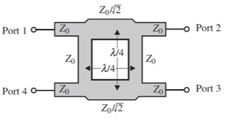
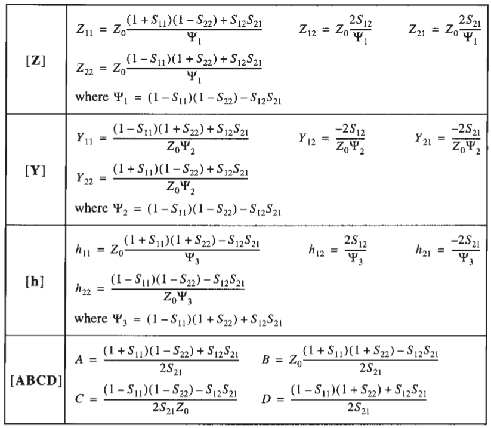
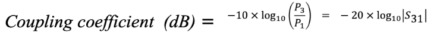
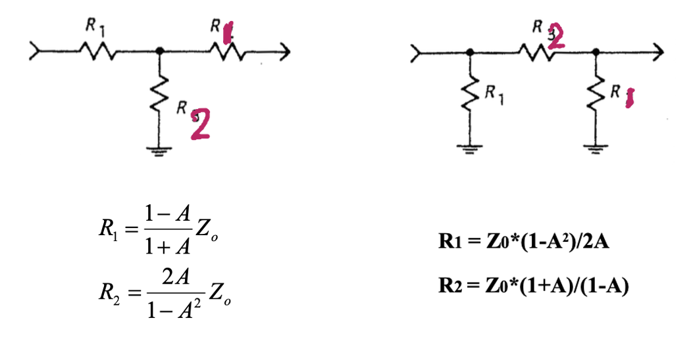
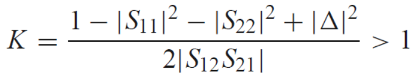

# 微波工程期末知识重点

雨霏 2023FA

> 目录已插入超链接，支持点击跳转。

[TOC]

> **基于课程进度的内容清单：**
>
> - **Week 9**
>  - 3/4 port S-P
>   - Couplers Basics
> - **Week 10**
>   - More Couplers
>   - Rat Race
>   - Wilkinson
>   - Even-Odd Mode
> - **Week 11**
>   - RF Circuits
> - **Week 12**
>   - Microwave Resonators
> - **Week 13**
>   - Filters
> - **Week 14**
>   - Amplifiers
> - **Week 15**
>   - Microstrip Antennas
>   - EM Simulator

## 面向器件设计的网络分析

### 概念回顾

对于二端口网络：波，电压电流和阻抗的关系如下所示：

利用波，我们可以定义 S 参数：

> **S参数具有物理意义：**
>
> 根据上述定义式进行理论分析：
>
> - **S11：**从1到1的散射——当从2没有入射（1激励、2匹配）时，1出射与1入射的比值；
> - **S21：**从1到2的散射——当从2没有入射（1激励、2匹配）时，2出射与1入射的比值；
> - **S12：**从2到1的散射——当从1没有入射（2激励、1匹配）时，1出射与2入射的比值；
> - **S22：**从2到2的散射——当从1没有入射（2激励、1匹配）时，2出射与2入射的比值。
>
> 我们可以借助 VNA 的测量过程理解这一过程：
>
> 
>
> - 当仅测量S11时（左），Port1指示灯亮，代表 VNA 从1端口给激励，2端口匹配，从1端口测量反射波判定S11；
> - 当同时测量S11和S21时（中），依然只是Port1亮灯，代表 VNA 从1端口给激励，2端口匹配，从1端口测量反射波判定S11，从2端口测量散射波判定S21；
> - 当同时测量S11和S12时（右），Port1和Port2指示灯交替闪烁，代表VNA时分复用地调整入射与激励端口——激励1匹配2测量S11，激励2匹配1测量S12。

S参数与电压/电流成正比，其平方与能量/功率成正比。将S参数化成分贝表示的过程中，需要给对数前乘以系数20，表示能量/功率的对数表示，比如从端口1到端口2的传输增益：
$$
Gain = 20lg(S_{21})
$$
对于反射能量，通常不讲Gain而讲Loss，比如1端口的反射损耗可以表示为：
$$
RL - 20lg(S_{11})
$$
常用的数据：当$S_{11}= 0.1$，$dB(S_{11})= -20$，此时99%的能量都进入了网络。
我们可以进一步定义 S 参数矩阵，更清晰地表示各个端口波的散射关系：

S参数矩阵是我们研究器件性能的重要工具。

#### 器件性质

- **匹配：**在其他端口全部匹配的前提下，所有端口的反射系数为0，

  反映在S参数矩阵：S参数矩阵对角全部为0；

- **无损：**所有传输进网络的能量最终都传出网络，网络不吸收任何能量，不会产热，

  反映在S参数矩阵，S为unitary matrix，S矩阵和他的共轭转置相乘为单位矩阵，$S^HS = I$；

- **互易：**所有端口正反S参数相同，

  反映在S参数矩阵，S为对称矩阵，转置等于自己，$S^T=S$。

#### 四端口无损互易匹配网络

==对于无源器件==，无损互益匹配三端口网络在数学上不存在，

但是四端口器件是存在的，这就是耦合器的数学模型。

在数学上，符合条件的模型具有两个通解： 

1. **对称结构：**S参数矩阵幅值两个变量，相位相差90度

   

   与这种结构对应的是分支线耦合器：

   

2. **反对称结构：**S参数矩阵幅值两个变量，$\beta$分别为0和180°

   

   与这种结构对应的是仓鼠轮耦合器（3和4标反了）：

   

由于需要满足无损，则上述$\alpha$和$\beta$模平方和一定。

### 参量矩阵

#### 常见结构的ABCD矩阵

> 值得注意的是：
>
> 对于传输线的ABCD矩阵，单根-地和并行两根都是相同的。
> 对于四分之一波长传输线，ABCD矩阵为：
> $$
> \begin{bmatrix}
> 0 & jZ_0 \\
> \frac{j}{Z_0}& 0
> \end{bmatrix}
> $$

#### 矩阵变换

- 常用矩阵转S参数

  

- S参数转常用矩阵

  

### 奇偶模

奇偶模是基于对称性的电路分析方法。

在我们需要研究的端口上，任何激励都可以被分为奇偶两部分。我们可以电路的对称轴将其分解为等效的几部分，在需要研究的端口上分别添加偶激励与奇激励。在奇偶激励下，电路在对称轴上的切口有以下特征：

- 对于偶激励，电路沿对称轴上没有电流，视作虚断（切口悬空）；
- 对于奇激励，电路沿对称轴上电流直通，视作虚短（切口接地）。

奇偶模分析的大致研究方法如下：

- 奇偶模分析：

  - **构建对称模型：**给14两个端口分别加奇偶激励，结构从中间对称。将模型中分传输线分成上下两个部分，上下两个部分分类讨论。写出上半部分S参数和激励之间的关系，

  - **奇偶模分类讨论：**偶模对称，中间相当于段路（悬空）；奇模贯穿，中间相当于短路（接地）。分析上半部分电路中各个部分的阻抗，利用阻抗导出ABCD矩阵，

    ABCD矩阵计算过程中需要对阻抗进行归一化，认为Z0=1，传输线Zc的系数需要带入计算。

  - **求解整个电路：**根据上半部分S参数矩阵求整个电路的S参数矩阵。

[点击返回目录](#微波工程期末考试知识重点)

## 无源器件

无源器件是一系列器件的统称，常见的无源器件包括以下内容。

> 将 Passive Circuits 译作“被动器件”属于是台湾风味。

### 功分器与耦合器

> 这一部分是下半学期的重中之重，需要掌握**定性与定量**分析方法。
>**这一部分的奇偶模分析一定要掌握！**

功分器与耦合器是非常重要的无源器件，他们可以用来进行功率的分配与合成。

耦合器通常包含四个端口：输入，直出，耦合，隔离。耦合器工作时呈现出方向性，即面对不同的输入，不同的端口呈现出的功能不同：

我们可以用S参数算出耦合器的性能指标：

#### Wilkinson 功分器

是一个三端口匹配无损器件：

他不互易：

#### 分支线耦合器

四段传输线构成的耦合器。

求得S参数矩阵如下：

可以看出分支线耦合器的功能如下：

- 从1入射的信号可以被均分至2和3，插入损耗为3dB；
- 理想状态下从4流出的能量为0；
- 信号之间的相位差90°。

分支线耦合器有着广泛的应用：

- 均衡放大器：需要两个相同的放大器，使放大器获得更小损耗、更大增益和更平稳的带内表现。
- 可变移相器：
- 可变衰减器：
- 相控阵天线：
- 球形天线的馈电网络：

#### 仓鼠轮耦合器

> 翻译有三重需求：信、达、雅。
> 我知道这个叫法不雅——这是为了保障信、达两项基本需求：
>
> 

类似于仓鼠轮形状的环形耦合器。

与之对应的S参数矩阵如下：

可以看出：

- 从1入射信号：
  - 信号从2和4中均分流出；
  - 信号相位差180°（相反数）；
  - 理想状态下，3中没有信号流出。
- 从3入射信号：
  - 能量从信号从2和4均分流出；
  - 信号相位差0°；
  - 理想状态下，1中没有信号流出。

仓鼠轮耦合器可以用于功率的定向分配，同时实现通信系统的收发功能：

#### 谐振定向耦合器

==FIXME：这一部分没有完全完成。==

#### Lange 耦合器

> 梦开始的地方

==FIXME：这一部分没有完全完成。==

### 谐振器

> 这一部分是实际工程问题中的重点，是许多其余器件的基础；
>需要掌握**定性与定量**分析方法。

谐振器是一种让微波信号在器件内形成驻波的信号的电路。

> 谐振器与驻波，就像是用微波炉加热奶酪。

**谐振器有着丰富的应用：**

- **滤波器：**只通过特定频率的信号；
- **振荡器：**产生并放大微波信号；
- **频率计：**用于测量信号的频率；
- **调谐放大器：**增强特定频率的信号。

#### RLC谐振器原型

谐振器的原形就是LC振荡器，理想的LC振荡器中，总能量不会衰减，能量在电容的电场和电感的磁场间不断转换：

> **研究振荡器过程中过程中，需要着重考虑以下问题：**
>
> - 谐振频率如何计算？
> - 对于微带线振荡器：
>   - 频率和微带线长度之间的联系？
>   - 谐振模式是什么？
>   - 加不加截止？
>   - Q 值的概念是什么？

在电路中串联或并联电阻R，即可构成RLC震荡电路：

- **对于串联RLC：**

  - 输入阻抗：

    

    可以化简为：

    

  - 输入功率：

    

    

    

  - 谐振条件和频率：

    

  - Q值：形容存储能量和损失能量之比；

    

    可以通过减小电阻来提高Q值；

  - 带宽：输入阻抗达到谐振的$\sqrt2$倍，此时能量为谐振时的二分之一；

    

    **带宽是1/Q！**

- **对于并联RLC：**

  - 输入阻抗：

    

  - 输入功率：

    

    

  - 谐振条件和频率：

    

  - Q值：

    

  - 带宽：Q分之一。

    

所有写真参数整理如下：

#### 微波谐振器

微波谐振器有着相当多的类别：

- **传输线谐振器：**是基于传输线构成的谐振器，根据传输线波长的不同有三种类型：

  与通过LC计算谐振频率不同，我们可以通过电长度计算和频率推导出线长。
  例如，对于半波长传输线，微带线传输线的线长为：
  $$
  l = \frac{\lambda}{2} = \frac{c}{2f\sqrt{\varepsilon_r}}
  $$

  - 短路（SC）半波长：等效串联RLC；

    

    波在传输线中的传输模式：

    

    传输线特征阻抗基本为实，长度基本为半波长，频率差异不大的前提下，**输入阻抗**为：

    

    基于类比，我们可以计算出传输线**等效的RCL**：

    

    我们可以计算出**Q值**：

    

  - 开路（OC）半波长：等效并联RLC；

    

    波在传输线中的传播模式：

    

    化简的**输入阻抗**：

    

    **等效RCL：**

    

    我们可以计算出**Q值**：

    

  - 开路（OC）四分之一波长：等效并联RLC。

  > **微带线谐振器的计算包含以下部分：**
  >
  > - **微带线计算：**通过特征阻抗，基板厚度，介电常数求出线宽和等效介电常数；
  >
  > - **计算线长：**通过等效介电常数求出波长，波长线长直接相关：
  >   $$
  >   l = \frac{c}{2f\sqrt{\varepsilon_r}}
  >   $$
  >   例如，线长是半波长，线长是四分之一波长等；
  >
  > - **计算Q值：**基于传输系数
  >
  >   - 求β：这里可以用2π除以波长；
  >
  >   - 求α：是传输系数实部，定义式如下，这个很复杂，如果有多个应该是加起来：
  >
  >     
  >
  >   - 求Q：$Q = \beta/2\alpha$。

- **矩形波导腔谐振器：**

  谐振频率：

  

  

  多个Q的合成：

  

  ==FIXME：这一部分没有完成，对应课件11的65页起。==

- **圆柱波导腔谐振器：**

  ==FIXME：这一部分没有完成，对应课件11的71页起。==

- **电介质谐振器：**

  ==FIXME：这一部分没有完成，对应课件11的77页起。==

#### 谐振器的耦合

谐振器需要通过不同的方式注入激励。

**耦合的效果可以用耦合系数g表示：**

- g < 1，欠耦合；
- g = 1，精准耦合；
- g > 1，过耦合。

精准耦合时：

**耦合方式主要有以下几种：**

- **传输线谐振：**馈线与微带线间隔传递激励；
- **矩形谐振：**同轴线传入激励；
- **圆柱谐振：**通过“光圈”结构引入激励；
- **电介质谐振器：**馈线直接耦合。

### 衰减器

> 也就是 T 型网络，需要掌握**定性与定量**分析方法。

衰减器是一种基于有损器件的网络，能够实现输入输出能量的衰减：

衰减器的S参数矩阵如下：

可以看出：

- 会对于信号进行比例为A的衰减；
- 输入输出匹配

常见的衰减器有着较大的带宽，其插入损耗的计算式为：

同理，我们可以通过10的指数求出衰减的实际幅值：
$$
A = 10^{-AdB/20}
$$
常用的衰减器有两种结构：T形和π形，我们可以分别进行定量运算：

### 环形器

> 这是一种基于铁氧体材料的器件，有可能需要**定性与定量**计算。

环路器是一种无损匹配三端口网络，他不匹配。

其功能主要是让1的能量从2出射，2的能量从3出射，3的能量从1出射。

器件的S参数矩阵如下：
$$
\begin{bmatrix}
S_{11} & S_{12} & S_{13} \\
S_{21} & S_{22} & S_{23} \\
S_{31} & S_{32} & S_{33} 
\end{bmatrix} = \begin{bmatrix}
0 & 0 & 1 \\
1 & 0 & 0 \\
0 & 1 & 0 
\end{bmatrix}
$$

### 滤波器

> 滤波器是一门专门的研究生课程，相当有挑战性；
>期末考试不会考察滤波器，但还是要了解基本概念。

==FIXME：这一部分没有完全完成，对应课件11.1和两个11.3。==

**设计器件有以下层级：**

1. **数学层：**多项式与近似；
2. **电路层：**基于传统电路理论的电路设计；
3. **分立层：**基于传输线的设计；
4. **物理层：**基于电磁场的仿真；
5. **优化层：**实际器件的优化。

设计滤波器是设计低通滤波器原型，再把他变换到需要的频段里。

> 因为因果性限制，理想低通不存在——这需要用负时间。 

[点击返回目录](#微波工程期末考试知识重点)

## 有源器件

### 放大器

> 这一部分非常重要，需要掌握**定性与定量**分析方法。
>**放大器的增益，一定要掌握！**

放大器是基于射频有源器件的放大电路。设计放大器的大致流程如下：

#### 稳定性分析

- 条件稳定：

  > 一定要理解稳定性圆，会**读稳定性圆图**。

  ==FIXME：稳定性圆的概念与读法，注意中文书少了一个叶子形阴影。==

- 无条件稳定： 

  - K-$\Delta$检验：

    

    

  - $\mu$检验：

    

#### 增益计算

> 好的微波放大器，几个增益基本一致。
>
> 对于实际场景：商家可能会提供一个general的增益供你选择。

==FIXME：真写不完了😭👊🏻，十七周考多好啊为啥要挤十六周？？==

### 射频开关

> 这一部分仅需了解概念。

#### 微波二极管

是一种有源器件，其性能取决于

- 半导体物理特性
- 器件的封装

射频二极管本质上是电压控制的电阻和电容。

> **需要强调的是：**
>
> 射频开关属于半导体器件，是有源器件！
> 有源器件可以同时实现无损、互易、匹配。

#### 结构与特征

射频开关在电路中有两种结构，串联式和并联式：

他们在性能上存在着一定差异：

基于射频开关，我们可以构建时分复用系统：

### 移相器

> 这一部分仅需了解概念。

顾名思义，对输入输出信号的相位进行移动：

基于可控移相器的天线阵列可以控制发射波前的方向，实现电磁波赋性，可以不通过机械运动只通过固态阵列与电子控制实现扫描，这就是相控阵雷达。

[点击返回目录](#微波工程期末考试知识重点)

## 天线

> 这一部分仅需了解概念。

==FIXME：这一部分没有完全完成。==

> 天线有喇叭天线，漏波天线，锅天线，方向性好的八木天线等等。
>
> 只有微带天线是微波工程师的原创；
> 他的长度是半波长，为的是构成谐振器，让电磁波晃荡晃荡晃荡然后辐射到空间里。

[点击返回目录](#微波工程期末考试知识重点)

## 电磁仿真

> 这一部分仅需了解概念。

==FIXME：这一部分没有完全完成，对应最后一次课件。==

> 仿真有两种思路；
>
> - 一种是变成等效电路（ADS），
> - 另一种是变成有限元（HFSS和CST）。布置网格的时候，一切都是根据波长来算的。

> 利用Y矩阵进行网络分析是最简单的。
>
> 电磁场仿真矩阵就是在填写Y矩阵。

[点击返回目录](#微波工程期末考试知识重点)
